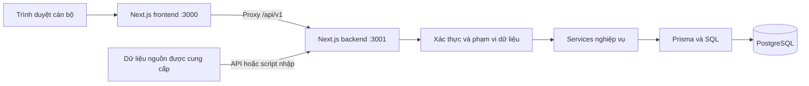
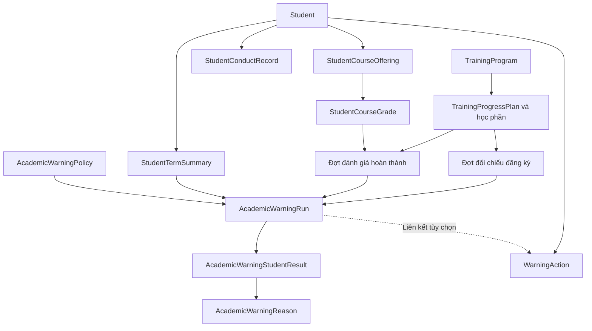
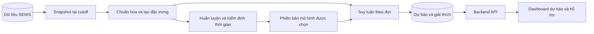

# Kiến trúc hệ thống theo dõi và cảnh báo sớm sinh viên

**Dự án:** SEWS — Student Early Warning System, Khoa Công nghệ Thông tin, Trường Đại học Đà Lạt.  
**Phiên bản:** 4.2 — 16/09/2026.

SEWS tập trung dữ liệu sinh viên để hỗ trợ cán bộ quản lý và cố vấn học tập phát hiện trường hợp cần theo dõi, tìm hiểu nguyên nhân và ghi nhận hỗ trợ. Kiến trúc gồm nền tảng học vụ, phần rèn luyện và hướng nghiên cứu dự báo nguy cơ học vụ bằng học máy. Chức năng tham gia hoạt động không nằm trong phạm vi sản phẩm vì chưa có nguồn dữ liệu chính thức.

Tài liệu phân biệt **hiện trạng mã nguồn**, **yêu cầu từ tài liệu nguồn** và **thiết kế đề xuất**. Phần ghi “đề xuất” chưa phải chức năng đã có. Hệ thống hỗ trợ ra quyết định; quyết định cảnh báo học vụ, kỷ luật và công nhận tốt nghiệp thuộc thẩm quyền nhà trường.

**Phạm vi ưu tiên cho báo cáo đồ án hiện tại:** hoàn thiện và kiểm chứng các chức năng học vụ đang có gồm hồ sơ sinh viên, dữ liệu điểm/đăng ký/quyết định, kế hoạch và tiến độ CTĐT, cảnh báo theo quy tắc, nhật ký hỗ trợ, phân quyền, dashboard và báo cáo. Kiến trúc học máy ở Mục 9 và kế hoạch NCKH ở Mục 13.2 được hoãn sang giai đoạn sau, không nằm trong tiêu chí hoàn thành phiên bản báo cáo đồ án này.

## 1. Căn cứ và phạm vi

### 1.1 Tài liệu nguồn

| Mã | Tài liệu | Nội dung dùng để thiết kế |
| --- | --- | --- |
| S1 | [Đề cương đồ án chuyên ngành](DeCuongDoAnCN_XayDungHeThongCanhBaoSomSinhVien.docx) | Mục 1–3, 5: học tập, rèn luyện, tham gia hoạt động; ngưỡng cảnh báo, dashboard, báo cáo và hỗ trợ. Mục 6: kế hoạch 08–11/2026. |
| S2 | [Thuyết minh đề tài NCKH sinh viên](TM-NCKH-26-27.doc) | Mục 9–14: dữ liệu lịch sử, đặc trưng, mô hình dự báo giai đoạn tiếp theo, giải thích và tích hợp; tiến độ 09/2026–05/2027. |
| S3 | [Quy chế đào tạo theo hệ thống tín chỉ](1.QuyCheDaoTaoTheoHeThongTinChi.docx) | Bản kèm QĐ 43/2007/QĐ-BGDĐT; Điều 10–12 về đăng ký/học lại, Điều 14–16 về học lực và thôi học, Điều 22–23 về điểm, Điều 27 về tốt nghiệp. |
| S4 | [Chương trình đào tạo CNTT năm 2020 K44](2020_CTDT_K44.pdf) | Mục 3–4, 6–8, 11: điều kiện đào tạo, khung tín chỉ, học phần, kế hoạch giảng dạy và hướng dẫn thực hiện. |
| S5 | [Quy định đánh giá kết quả rèn luyện](99-QD-DHDL_240216-Qui-dinh-danh-gia-ket-qua-ren-luyen.pdf) | QĐ 99/QĐ-ĐHĐL năm 2016; Điều 3–11 về tiêu chí, thang điểm, phân loại và quy trình; Điều 13–19 về sử dụng kết quả, khiếu nại và trách nhiệm đơn vị. |

S3 là văn bản năm 2007 được cung cấp trong repository; S4 là CTĐT năm 2020. Quy tắc phải gắn với phiên bản và khóa áp dụng, không mặc định là quy định hiện hành cho mọi khóa. Không suy ra nội dung Thông tư 08/2021 chỉ từ danh mục tham khảo của S1. Trước khi vận hành tiêu chí chính thức, cần xác nhận văn bản áp dụng tại trường.

S1 yêu cầu sản phẩm theo dõi đa nguồn; S2 bổ sung nghiên cứu dự báo. Hai hồ sơ khác nhau về tiến độ, danh sách thành viên, người hướng dẫn và một số thông tin sinh viên. Tài liệu kiến trúc không hợp nhất các thông tin hành chính này thành một danh sách đã xác nhận.

### 1.2 Phân biệt ba loại kết quả

| Loại | Câu hỏi trả lời | Căn cứ |
| --- | --- | --- |
| Cảnh báo theo quy tắc | Hiện tại sinh viên có chỉ số nào cần theo dõi? | Dữ liệu đã có, kế hoạch và ngưỡng nội bộ |
| Dự báo nguy cơ | Sinh viên có nguy cơ bị cảnh báo ở kỳ tiếp theo không? | Mô hình kiểm định trên dữ liệu lịch sử tại thời điểm dự báo |
| Quyết định chính thức | Nhà trường đã ban hành quyết định gì? | Số quyết định, ngày ký, nội dung, phạm vi áp dụng |

Quyết định cảnh báo cũ có thể là dấu hiệu cần theo dõi, nhưng không chứng minh sinh viên sẽ bị cảnh báo kỳ tiếp theo. Màu cảnh báo nội bộ không tương đương mức kỷ luật.

### 1.3 Phạm vi triển khai

| Năng lực | Hiện trạng | Đích cần đạt |
| --- | --- | --- |
| Hồ sơ, lớp, khóa, CTĐT, điểm, đăng ký | Có schema, API, giao diện | Chuẩn hóa và truy xuất nguồn |
| Đăng ký, tiến độ, hoàn thành CTĐT | Có kế hoạch phiên bản và đợt tính | Làm rõ thời điểm, ngoại lệ, điều kiện tốt nghiệp |
| Cảnh báo học vụ | Có bộ máy theo run với chính sách GPA và 5 mã nguyên nhân; báo cáo live hiện phân loại theo GPA/quyết định | Nhất quán phạm vi, phiên bản, ngưỡng và giải thích giữa hai chế độ |
| Rèn luyện | Có `StudentConductRecord`, điểm trong `StudentTermSummary`, API đọc tổng hợp | Xác định điểm công nhận và tiêu chí theo dõi |
| Hoạt động | Không có nguồn dữ liệu chính thức; không triển khai giao diện/API | Ngoài phạm vi phiên bản hiện tại |
| Hỗ trợ | Có `WarningAction`, API đọc/tạo | Hồ sơ, người phụ trách, chuyển trạng thái có kiểm soát |
| Học máy | Chưa có pipeline, mô hình, kho dự báo | Nghiên cứu và tích hợp theo S2 |
| Báo cáo, nhập/xuất | Báo cáo cảnh báo live chọn kỳ đủ độ phủ; giao diện xuất CSV; một số API `export` trả JSON | Báo cáo đa nguồn và file XLSX/PDF đúng định dạng theo S1 |
| Đồng bộ, thông báo tự động | Có API/script nhập; chưa có scheduler/dịch vụ gửi vận hành | Bổ sung khi nguồn và quy trình được xác nhận |

Sinh viên, phụ huynh chưa có cổng đăng nhập riêng. Việc lấy dữ liệu đào tạo, CTSV, Đoàn–Hội cần nguồn được đơn vị quản lý cung cấp; không giả định đã có API tích hợp trực tiếp.

## 2. Người sử dụng và quy trình

S1/S2 xác định cán bộ quản lý và cố vấn học tập là nhóm sử dụng chính. S5 phân định trách nhiệm GVCN, hội đồng khoa, Phòng CTSV và hội đồng trường. Bảng dưới là ánh xạ nghiệp vụ đề xuất, không phải role đã seed sẵn.

| Vai trò | Công việc | Phạm vi dự kiến |
| --- | --- | --- |
| Ban chủ nhiệm khoa | Theo dõi tình hình, ưu tiên hỗ trợ, báo cáo | Khoa phụ trách |
| GVCN/CVHT | Rà soát hồ sơ, tư vấn, ghi nhật ký | Lớp được phân công |
| Giáo vụ/chuyên viên | Chuẩn hóa hồ sơ, CTĐT, kết quả, báo cáo | Khoa/dữ liệu được giao |
| Trợ lý CTSV/cán bộ CTSV | Đối chiếu rèn luyện, quyết định, phối hợp hỗ trợ | Theo phân công đơn vị |
| Quản trị | Tài khoản, quyền, cấu hình, nguồn dữ liệu | Quyền quản trị được cấp |
| Nhóm nghiên cứu | Chuẩn bị dữ liệu, huấn luyện, đánh giá | Dữ liệu nghiên cứu được phép sử dụng |

Người chỉ cần thống kê, như cán bộ truyền thông, cần quyền báo cáo tổng hợp riêng; không mặc nhiên được đọc hồ sơ và ghi chú tư vấn cá nhân.

Luồng nghiệp vụ:

1. Tiếp nhận dữ liệu theo năm học, kỳ, khóa và CTĐT; kiểm tra định danh, trùng lặp và độ đầy đủ.
2. Tách bản ghi chưa xác định được kỳ để rà soát; xác nhận kế hoạch, chính sách và thời điểm đánh giá.
3. Chạy đối chiếu đăng ký, hoàn thành rồi cảnh báo học vụ. Khi có mô hình nghiệm thu, chạy dự báo với kỳ mục tiêu riêng.
4. Hiển thị mức ưu tiên, từng nguyên nhân, bằng chứng và dữ liệu thiếu.
5. Cán bộ rà soát, trao đổi với sinh viên, ghi nguyên nhân thực tế và biện pháp hỗ trợ.
6. Có dữ liệu mới thì tạo đợt đánh giá mới, đối chiếu kết quả hỗ trợ và giữ lịch sử.
7. Tổng hợp báo cáo theo đúng kỳ, phạm vi và nguồn tính.

“Đã hỗ trợ xong” và “không còn vi phạm ngưỡng” là hai trạng thái độc lập. Nhật ký hỗ trợ không tự xóa nguyên nhân cảnh báo.

## 3. Kiến trúc ứng dụng hiện tại

Repository là **npm monorepo với hai ứng dụng Next.js độc lập**; backend chia module nghiệp vụ dùng chung PostgreSQL. Chưa có Express, NestJS, microservice ML hay message broker trong triển khai hiện tại.



Frontend gọi API cùng origin. `apps/frontend/proxy.ts` chuyển request tới `BACKEND_URL` tại runtime; server layout xác minh phiên qua `/api/v1/auth/me`. Backend kiểm tra JWT, quyền và phạm vi dữ liệu, không tin kiểm tra ở giao diện.

| Thành phần | Công nghệ trong package hiện tại |
| --- | --- |
| Frontend | Next.js 16.3.4, React 19.2.8, TypeScript |
| UI và state | Tailwind CSS 4, Lucide React, Recharts, Zustand |
| Backend | Next.js Route Handlers, TypeScript |
| Persistence | PostgreSQL, Prisma 6 |
| Auth | `jose`, `bcryptjs`, HttpOnly cookie |
| Kiểm thử | Node.js test runner, `tsx` |

```text
apps/
  frontend/
    app/(auth)/              Đăng nhập
    app/(dashboard)/         Dashboard, sinh viên, học vụ, cảnh báo, báo cáo
    components/              Thành phần dùng chung
    hooks/ và stores/         Logic và trạng thái giao diện
    lib/backend-origin.ts    Origin backend phía server
    proxy.ts                 Chuyển tiếp API
  backend/
    app/api/v1/              Route Handlers
    lib/auth/                Xác thực, quyền, phạm vi
    lib/services/            Nghiệp vụ
    lib/utils/               Response, lỗi, định danh
    prisma/                  Schema và migration
    scripts/                 Nhập dữ liệu
    tests/                   Kiểm thử và danh sách API
    proxy.ts                 Kiểm tra biên API và request ID
docs/                        Tài liệu nguồn và kiến trúc
scripts/                     Chạy hai ứng dụng, smoke test
legacy/vite/                 Mã tham khảo, không tham gia build
```

Route xử lý HTTP/phân quyền; service thực hiện nghiệp vụ; Prisma/SQL truy cập dữ liệu. Frontend không import Prisma hoặc mã backend. Một số route đơn giản, như nhật ký hỗ trợ, truy cập Prisma trực tiếp; khi quy trình phức tạp hơn cần chuyển logic vào service.

## 4. Mô hình dữ liệu hiện tại

[Schema Prisma](../apps/backend/prisma/schema.prisma) và [migration](../apps/backend/prisma/migrations) là căn cứ cấu trúc vật lý. Không dùng ERD giả định có `warning_rule`, `student_warning`, `course_result`, `curriculum_course` để mô tả database hiện tại.

| Miền | Model chính |
| --- | --- |
| Tổ chức đào tạo | `Student`, `Class`, `Cohort`, `AcademicYear`, `AcademicTerm` |
| CTĐT | `TrainingProgram`, `Course`, `TrainingProgramCourse` |
| Đăng ký, điểm | `StudentCourseOffering`, `StudentCourseGrade` |
| Tổng hợp học tập | `StudentTermSummary`, `StudentCumulativeSummary` |
| Rèn luyện | `StudentConductRecord` |
| Nhập dữ liệu | `GradeImportBatch`, `GradeImportError`, `UnscopedGradeRecord` |
| Quyết định, học phí | `DecisionType`, `StudentDecision`, `FeePolicyType`, `StudentFeePolicy` |
| Kế hoạch | `TrainingProgressPlan`, `TrainingProgressPlanCourse` |
| Đánh giá đăng ký | `TrainingProgressCalculationRun`, `TrainingProgressStudentResult`, `TrainingProgressCourseResult`, `TrainingProgressGroupResult` |
| Đánh giá hoàn thành | `TrainingProgressCompletionRun`, `TrainingProgressCompletionStudentResult`, `TrainingProgressCompletionPlanResult`, `training_progress_completion_course_results`, `TrainingProgressCompletionGroupResult` |
| Cảnh báo | `AcademicWarningPolicy`, `AcademicWarningRun`, `AcademicWarningStudentResult`, `AcademicWarningReason`, `AcademicWarningGroupResult` |
| Hỗ trợ | `WarningAction` |
| Truy cập, audit | `User`, `Role`, `Permission`, `UserRole`, `RolePermission`, `LecturerProfile`, `ClassAdvisorAssignment`, `RefreshToken`, `AuditLog` |



Sơ đồ thể hiện quan hệ nghiệp vụ, không khẳng định mọi mũi tên là relation Prisma. Nhiều UUID/mã nguồn được nối bằng SQL; cần đọc migration để kiểm tra khóa ngoại, check constraint và index.

Phân biệt ID nội bộ và mã nguồn: `Student.id` khác MSSV `sStudentId`; `Class.id` khác mã lớp `classId`; `TrainingProgram.id` khác `sProgramCode`. Tổng hợp điểm có khóa sinh viên–chương trình–học kỳ; rèn luyện có khóa sinh viên–học kỳ.

## 5. Tiếp nhận và chất lượng dữ liệu

Nguồn học vụ gồm hồ sơ, lớp/khóa, CTĐT, đăng ký, điểm, tổng hợp theo kỳ, quyết định. Nguồn rèn luyện/hoạt động cần hợp đồng dữ liệu với đơn vị phụ trách theo S1/S5.

Nhiều model có `sourcePayload`, `sourceMd5`, `gradeImportBatchId`; đợt tiến độ/hoàn thành có snapshot và hash. Đây là nền truy vết, chưa chứng minh đã lưu mọi lần sửa ở hệ thống nguồn.

- Phân biệt `null`, chờ điểm, không tính điểm, thiếu kỳ và điểm 0. Không thay dữ liệu thiếu bằng “đạt”.
- Không cộng tín chỉ tích lũy nhiều lần do học lại cùng học phần. Giữ từng lần học và chọn bằng chứng theo mục đích tính.
- Đánh giá lịch sử phải giới hạn theo kỳ/cutoff; không dùng tổng hợp tích lũy mới nhất thay số liệu tại kỳ cũ.
- Dữ liệu dự báo cần phân biệt ngày phát sinh, ngày nguồn công bố và ngày nhập SEWS.
- CTĐT phải gắn khóa/phiên bản, nhóm tự chọn, học phần tương đương, thay thế và miễn trừ.
- Nhập lại phải có quy tắc cập nhật/trùng lặp xác định. Script thay thế dữ liệu vận hành riêng, không chạy trong build/test.

Staging, duyệt lô nhập đa nguồn, lịch sử thay đổi đầy đủ và đồng bộ định kỳ là phần cần phát triển.

## 6. Học vụ, tiến độ và hoàn thành

### 6.1 Căn cứ đào tạo

S3 phân biệt bắt buộc/tự chọn, học lại, điểm đạt/không đạt, ký hiệu thiếu kết quả và mục đích GPA. Điều 22–23 quy đổi A/B/C/D/F thành 4/3/2/1/0; GPA là trung bình theo trọng số tín chỉ. GPA xét học bổng và GPA xét học lực có cách chọn lần thi khác nhau. Backend chủ yếu dùng GPA tổng hợp nguồn, chưa phải bộ tính mọi loại GPA theo quy chế.

Điều 10 của S3 ghi tối thiểu 14 tín chỉ với học lực bình thường, 10 với học lực yếu, có ngoại lệ kỳ cuối/kỳ phụ; học lực yếu tối đa 14 tín chỉ. Đây là quy tắc có điều kiện trong văn bản nguồn, không phải ngưỡng chung cho mọi sinh viên.

Điều 16 mang tên **“Bị buộc thôi học”**. Không đổi nhãn các ngưỡng này thành cảnh báo sớm nội bộ hay tự động ban hành quyết định. Hai ngưỡng GPA hiện tại chưa thực hiện đầy đủ điều kiện năm đào tạo, chuỗi học kỳ và ngoại lệ trong điều này.

### 6.2 CTĐT K44

S4 mục 6, trang PDF 22–23 (trang in 21–22), ghi **150 tín chỉ không gồm GDTC và GDQP–AN**: 46 đại cương, 104 giáo dục chuyên nghiệp; theo tính chất là 104 bắt buộc, 46 tự chọn. GDTC 3 và GDQP–AN 8,5 tín chỉ ghi riêng trong ngoặc.

Không cộng toàn bộ danh sách tự chọn thành yêu cầu hoàn thành; cần nhóm, số tín chỉ phải chọn và phương án tốt nghiệp. Không áp dụng 150 cho CTĐT khác chỉ vì cùng ngành. Cần rà soát biểu diễn tín chỉ lẻ: trường tín chỉ học phần hiện dùng `Int`, còn nguồn có GDQP–AN 8,5 tín chỉ.

### 6.3 Đối chiếu đăng ký

`evaluateProgress()` trong [training-progress.ts](../apps/backend/lib/services/training-progress.ts) kiểm tra học phần bắt buộc, tự chọn chỉ định, ngưỡng tín chỉ tự chọn và thống kê học phần ngoài kế hoạch. Kết quả là `pass`, `fail`, `data_error`. Nhóm `choiceGroupCode` hiện yêu cầu chọn đúng một học phần; chưa hỗ trợ tổng quát “chọn N trong M”, chọn nhiều hơn một có thể không đạt.

Kế hoạch có phiên bản, clone, activate, lock, archive. Đợt tính lưu phiên bản kế hoạch, snapshot, hash và kết quả; thay đổi kế hoạch phải giữ ý nghĩa kết quả cũ.

**Đủ đăng ký không đồng nghĩa đúng hạn.** Chưa có bộ dữ liệu chuẩn hóa gồm thời điểm từng lần đăng ký, hạn, rút/hủy hợp lệ và ngoại lệ. Chỉ số “đúng hạn” cần các dữ liệu này; đối chiếu hiện tại chỉ phản ánh đáp ứng kế hoạch tại lần chụp dữ liệu.

### 6.4 Tiến độ và hoàn thành

`evaluateCompletionPlan()` đối chiếu kế hoạch với bằng chứng đạt đến kỳ xét. `loadPassingEvidence()` hiện lấy `isPass=true`, `scoreStatus='graded'`, `notScore=false`, giữ một bằng chứng đạt theo học phần trong phạm vi thời gian.

| Trục | Trạng thái | Ý nghĩa |
| --- | --- | --- |
| Tiến độ đến kỳ xét | `on_track`, `behind_schedule`, `pending_result`, `no_due_plan`, `data_error` | Đáp ứng kế hoạch đến hạn, còn thiếu hoặc chờ dữ liệu |
| Hoàn thành CTĐT | `completed`, `incomplete`, `cannot_determine` | Đáp ứng yêu cầu đã mô hình hóa và đủ độ bao phủ kế hoạch |

Chế độ `forecast` có thể giả định học phần đang đăng ký, đủ điều kiện chờ kết quả, sẽ đạt. Hiển thị rõ giả định và tách khỏi `standard`. Đây là kịch bản hoàn thành học phần, chưa phải học máy hay dự đoán ngày tốt nghiệp.

`completed` không đồng nghĩa được công nhận tốt nghiệp. S3 Điều 27 còn yêu cầu GPA tích lũy từ 2,00, chứng chỉ, nhóm học phần, tình trạng kỷ luật/pháp lý; S4 dẫn chiếu quy định trường. Cần thêm điều kiện tốt nghiệp, chứng chỉ, miễn trừ và xác nhận có thẩm quyền trước khi kết luận đủ điều kiện xét tốt nghiệp.

## 7. Bộ máy cảnh báo hiện tại

### 7.1 Cảnh báo theo đợt chạy

[academic-warnings.ts](../apps/backend/lib/services/academic-warnings.ts) lấy chính sách active phiên bản mới nhất, CTĐT, khóa, kỳ xét. Cần có đợt đối chiếu đăng ký hoàn tất của kế hoạch hiện hành đã khóa và đợt hoàn thành cùng phạm vi. GPA lấy đúng kỳ/chương trình; quyết định nguồn lấy đến kỳ xét.

`AcademicWarningPolicy` chứa `termGpaThreshold`, `cumulativeGpaThreshold` trong thang 0–4, có phiên bản/trạng thái. Tạo active mới sẽ lưu trữ active cũ. Chưa có bảng quy tắc cấu hình tổng quát mọi toán tử, nguồn và mức độ.

| Mã nguyên nhân | Điều kiện trong `evaluate()` | Mức |
| --- | --- | --- |
| `REGISTRATION_BEHIND` | Đối chiếu đăng ký là `fail` | `medium` |
| `PROGRAM_PROGRESS_BEHIND` | Tiến độ `behind_schedule` | `high` |
| `LOW_TERM_GPA` | GPA kỳ hệ 4 nhỏ hơn ngưỡng chính sách | `medium` |
| `LOW_CUMULATIVE_GPA` | GPA tích lũy hệ 4 nhỏ hơn ngưỡng | `high` |
| `ACADEMIC_WARNING_DECISION` | Có quyết định cảnh báo nguồn đến kỳ xét | `high` |

Mức chung là cao nhất: `none` → Xanh, `medium` → Vàng, `high` → Đỏ. Không tính ARI và không có Cam. Ngưỡng GPA là chính sách theo dõi nội bộ, không tự gán là ngưỡng chính thức của trường.

Reason lưu mã, tiêu đề, mức, `details`, `sourceType`, `sourceId`; reason GPA liên kết trực tiếp tới `StudentTermSummary` hoặc `StudentCumulativeSummary`. Run lưu snapshot đầu vào, hash SHA-256 và thời điểm chụp, bao gồm policy, nguồn tiến độ/hoàn thành, GPA và quyết định để tái hiện lịch sử.

Thiếu tổng hợp kỳ được ghi vào `dataError`; GPA `null` không kích hoạt so sánh. `maxSeverity=none` có thể đi cùng thiếu dữ liệu: UI/báo cáo phải thể hiện riêng, tránh coi Xanh là đã xác nhận an toàn.

### 7.2 Báo cáo cảnh báo live và kỳ thống kê

Trang báo cáo hiện không đọc `AcademicWarningStudentResult` để dựng toàn bộ thống kê. [reports.ts](../apps/backend/lib/services/reports.ts) tính trực tiếp từ `StudentTermSummary` và quyết định cảnh báo của đúng kỳ báo cáo. Báo cáo live hiện có ba nguyên nhân: `LOW_TERM_GPA`, `LOW_CUMULATIVE_GPA` và `ACADEMIC_WARNING_DECISION`; chưa bao gồm hai nguyên nhân tiến độ của bộ máy theo run.

Kỳ báo cáo tự động trước hết loại mọi kỳ có `sIsSummer = true`, sau đó chọn theo độ phủ GPA học kỳ. Hệ thống ưu tiên kỳ chính gần nhất có GPA học kỳ của ít nhất 80% sinh viên trong phạm vi (`MIN_REPORTING_TERM_GPA_COVERAGE = 0.8`). Nếu chưa kỳ chính nào đạt 80%, hệ thống dùng kỳ chính gần nhất có ít nhất một bản ghi GPA học kỳ; kỳ hoàn toàn chưa có GPA không được chọn. Người dùng vẫn có thể chọn kỳ hè thủ công, nhưng response và giao diện bắt buộc gắn nhãn số liệu mô tả, tỷ lệ tham gia và cảnh báo rằng đây không phải kết quả xếp hạng độc lập.

Báo cáo bắt buộc dùng `AcademicWarningPolicy` active có phiên bản. Không còn ngưỡng dự phòng viết trong mã; nếu chưa có policy, API trả lỗi cấu hình `WARNING_POLICY_REQUIRED`. Seed tạo policy demo phiên bản 1 cùng người kích hoạt và audit. Nếu một sinh viên thỏa nhiều điều kiện, Đỏ ưu tiên hơn Vàng.

`dashboard.ts` dùng cùng `ReportsService` cho số lượng và danh sách cảnh báo live, nhưng dùng kết quả run gần nhất cho trạng thái đăng ký/tiến độ. Khi có bộ lọc kỳ, cả hai nguồn dùng đúng kỳ được chọn; khi không lọc, dashboard neo vào kỳ báo cáo gần nhất đủ độ phủ. Response `dataContext` và giao diện ghi rõ mode, policy, kỳ, run ID và cutoff nên không xem các nguồn là một snapshot duy nhất.

Các việc cần chuẩn hóa:

- Gắn cutoff, kỳ, khóa, CTĐT, chế độ tính; không lấy forecast để khẳng định hoàn thành thực tế.
- Hoàn thiện cách chọn đợt phụ thuộc, snapshot và nguồn lý do.
- Xử lý riêng thiếu tiến độ, hoàn thành, GPA và quyết định chưa gắn kỳ.
- Giữ rõ nhãn kỳ thống kê và độ phủ dữ liệu; không tự chuyển sang kỳ hiện tại chỉ vì kỳ đó được đánh dấu `isCurrent`.
- Thay ngưỡng dự phòng 2,0 viết trong mã bằng chính sách được kích hoạt, hoặc cấu hình fallback có phiên bản và audit rõ ràng.
- Ghi rõ báo cáo live và cảnh báo theo run là hai chế độ khác nhau; nếu hợp nhất thì phải dùng cùng kỳ, scope, policy và cutoff.
- Khi dashboard cho phép lọc kỳ, truyền kỳ đó vào nguồn cảnh báo hoặc hiển thị riêng kỳ thực tế của từng khối số liệu.

## 8. Rèn luyện và dữ liệu hoạt động ngoài phạm vi

S5 dùng thang 100 với năm mặt: học tập 20; nội quy 25; hoạt động chính trị/xã hội/văn hóa/thể thao 20; ý thức công dân/cộng đồng 25; cán bộ/tổ chức/thành tích đặc biệt 10. Điều 6 có cộng điểm; không thể tái dựng điểm chính thức chỉ từ số lượt hoạt động.

Điều 7 phân loại 90–100 xuất sắc, 80–89 tốt, 65–79 khá, 50–64 trung bình, 35–49 yếu, dưới 35 kém. Điều 8 có giới hạn theo kỷ luật và trường hợp đặc biệt. Với điểm thập phân, giữ giá trị nguồn và xác nhận quy tắc làm tròn trước khi phân loại.

Điều 9 quy định sinh viên/lớp, GVCN, hội đồng khoa, hội đồng trường và quyết định Hiệu trưởng; có công bố để sinh viên phản hồi trước quyết định chính thức. Điều 10–11 quy định kỳ/năm/toàn khóa; nội dung kỳ hè dùng cho kỳ chính tiếp theo. Cần giữ kỳ phát sinh và kỳ tính điểm.

`StudentConductRecord` có `studentScore`, `classScore`, `departmentScore`, `lastScore`, `statusId`, payload nguồn. Chưa có ánh xạ được xác nhận từ `statusId` sang phê duyệt; không mặc định `lastScore` đã được công nhận. Ưu tiên tiếp nhận kết quả từ đơn vị phụ trách. Nếu xây quy trình tự đánh giá đầy đủ, cần tiêu chí phiên bản, điểm thành phần, minh chứng, phê duyệt, khiếu nại và quyết định; đây là thiết kế mới.

Không có nguồn dữ liệu hoạt động đủ tin cậy để xác định sinh viên có tham gia hay không. Vì vậy hệ thống không hiển thị tỷ lệ tham gia, không cung cấp API nhập thủ công và không dùng dữ liệu này trong cảnh báo. Các bảng `Activity` và `ActivityParticipation` đã từng được tạo được giữ lại để bảo toàn lịch sử, nhưng không còn được giao diện hoặc dịch vụ nghiệp vụ sử dụng.

Không tự cộng trọng số hoạt động vào điểm rèn luyện vì có nguy cơ tính trùng thông tin đã nằm trong kết quả rèn luyện chính thức.

### 8.1 Quy tắc học kỳ hè

Kỳ hè là kỳ phụ có dữ liệu vận hành riêng. Hệ thống xác định bản chất kỳ bằng `AcademicTerm.sIsSummer`, không suy luận từ mã `HK03`. Quan hệ kỳ chính trước và sau được suy ra từ ngày bắt đầu đã cấu hình, với năm học và `sTermOrder` làm thứ tự dự phòng. API kỳ trả `previousMainTermId` và `nextMainTermId` để các màn hình không hard-code HK1 hoặc HK2.

| Mã | Quy tắc triển khai |
| --- | --- |
| R1 | Dữ liệu kỳ hè lưu riêng và giữ `sIsSummer = true`; không trộn hoặc xóa bản ghi nguồn. |
| R2 | Kết quả học tập hè thuộc kỳ chính ngay trước khi xếp hạng. Hệ thống chỉ hiển thị quan hệ và trạng thái nguồn; chưa tự cộng GPA khi chưa xác nhận Portal đã gộp hay chưa. |
| R3 | Nội dung rèn luyện hè hướng tới kỳ chính tiếp theo. Điểm nguồn hè không được phân loại thành kết quả chính thức riêng. |
| R4 | Run `OFFICIAL` từ kỳ hè bị từ chối. `SUMMER_MONITORING` chỉ tạo tín hiệu hỗ trợ từ kết quả chờ hoặc học phần chưa đạt. |
| R5 | Không tạo `TrainingProgressPlan` cho kỳ hè. Completion reconciliation có thể chạy tại cutoff hè và dùng học phần đạt trong hè làm bằng chứng cho milestone gốc. |
| R6 | Chọn kỳ báo cáo tự động luôn loại kỳ hè trước khi xét độ phủ. |
| R7 | Bộ lọc cho phép chọn kỳ hè thủ công nhưng phải hiển thị nhãn kỳ phụ, số người tham gia và độ phủ. |
| R8 | GPA hè thô là điểm mô tả tách biệt; đường xu hướng chính chỉ nối các kỳ chính. |
| R9 | Kỳ hè có thể là `isCurrent` cho vận hành, nhưng `getCurrentAcademicContext()` trả thêm `defaultReportingTerm` là kỳ chính. |
| R10 | Liên kết kỳ dựa trên ID và thời gian cấu hình, không dựa riêng vào mã kỳ. |

`SUMMER_MONITORING` không áp dụng tiêu chí thiếu tín chỉ đăng ký tối thiểu, GPA hè độc lập, quyết định cảnh báo cũ hoặc phân loại rèn luyện. Migration `20260920090000_summer_term_semantics` thêm `AcademicWarningRun.runMode` và đánh dấu run lịch sử trên kỳ hè là `LEGACY_SUMMER` để giao diện hiển thị là tham khảo.

## 9. Kiến trúc học máy đề xuất — hoãn sau báo cáo đồ án

Phần này đáp ứng S2 mục 11–12; repository chưa triển khai các thành phần sau.

### 9.1 Bài toán

Đơn vị quan sát là **sinh viên–chương trình–học kỳ**. Tại cutoff `t`, ước lượng nguy cơ có cảnh báo học vụ kỳ `t+1`. Xác nhận nhãn là quyết định cảnh báo thực tế hay thỏa bộ tiêu chí được duyệt; không trộn hai cách tạo nhãn.

Đặc trưng ứng viên: GPA/xu hướng, tín chỉ đăng ký/tích lũy, học phần chưa đạt, học lại, thiếu so kế hoạch, tiền sử cảnh báo, rèn luyện/hoạt động nếu đủ tin cậy. Lưu phiên bản, thời điểm khả dụng và nguồn.

Không dùng điểm công bố sau cutoff, quyết định kỳ mục tiêu hoặc tổng hợp tích lũy mới nhất cho mẫu lịch sử. Nếu chỉ có bản cuối, không tái dựng được thời điểm khả dụng, phải ghi giới hạn thực nghiệm. Không công bố độ chính xác chưa đo.

### 9.2 Pipeline



Pipeline chạy ngoài vòng đời HTTP Next.js. Python là lựa chọn đề xuất cho thử nghiệm, chưa bắt buộc FastAPI/Redis/cụm worker. Có thể bắt đầu bằng batch và nhập kết quả kiểm chứng; thêm worker/hàng đợi khi thời gian xử lý, lịch chạy yêu cầu.

Logistic Regression, Decision Tree, Random Forest, SVM được S2 nêu trong tổng quan là ứng viên so sánh, chưa có mô hình thắng chọn trước. So với baseline đơn giản và bộ quy tắc trên cùng cutoff/kỳ mục tiêu.

Chia train/validation/test theo thời gian; kiểm soát một sinh viên xuất hiện nhiều kỳ và đánh giá sang khóa mới. Fit tiền xử lý, xử lý mất cân bằng chỉ trên train. S2 yêu cầu Precision, Recall, F1, ma trận nhầm lẫn; đề xuất thêm PR-AUC, chất lượng xác suất và kết quả theo khóa khi đủ dữ liệu. Chọn ngưỡng trên validation theo năng lực hỗ trợ, không tối ưu trên test.

### 9.3 Dữ liệu dự báo đề xuất

| Thực thể | Nội dung |
| --- | --- |
| `ResearchDataset` / `FeatureSnapshot` | Phiên bản, cutoff, đặc trưng, nhãn, nguồn, hash, cách chia tập |
| `ModelVersion` | Thuật toán, artifact, tiền xử lý, dữ liệu huấn luyện, chỉ số, trạng thái |
| `PredictionRun` | Mô hình, cutoff, kỳ mục tiêu, phạm vi, thời gian, lỗi |
| `StudentRiskPrediction` | Sinh viên/chương trình, xác suất hoặc điểm, mức nguy cơ, dữ liệu thiếu, giải thích |

Chỉ gọi đầu ra là xác suất khi mô hình/kiểm định hỗ trợ diễn giải đó. Đóng góp của đặc trưng không chứng minh nhân quả. UI hiển thị dự báo riêng với mô hình, kỳ mục tiêu, thời điểm dữ liệu; không ghi đè `AcademicWarningStudentResult` hay tạo `StudentDecision` từ dự báo.

## 10. Hỗ trợ và báo cáo

`WarningAction` lưu sinh viên, run tùy chọn, loại hành động, ghi chú, ID/tên người thao tác, người phụ trách, hạn xử lý, thời điểm hoàn tất, lịch sử trạng thái và thời gian cập nhật. API có GET/POST/PATCH/PUT; bản ghi mới mặc định `OPEN`. Backend kiểm soát `OPEN → IN_PROGRESS → RESOLVED`, chuyển cấp và mở lại, dùng optimistic concurrency và ghi audit. Trạng thái `RESOLVED` chỉ xác nhận hoàn tất hồ sơ hỗ trợ, không xác nhận sinh viên hết nguy cơ.

Đề xuất hồ sơ gắn sinh viên/giai đoạn, người phụ trách, lý do, thời hạn, kết quả, lịch sử trạng thái. Luồng có thể `OPEN → IN_PROGRESS → RESOLVED`, thêm `ESCALATED` và mở lại; cần thống nhất điều kiện rồi kiểm soát ở backend. Lưu ID người thực hiện bên cạnh tên.

Dashboard tách số sinh viên, nguyên nhân, quyết định và hành động. Một người nhiều lý do chỉ tính một lần trong tổng cảnh báo. Chỉ số theo run dùng cùng `runId`; dữ liệu mới nhất có nhãn thời điểm. Báo cáo kèm kỳ, khóa/CTĐT, chính sách/mô hình, scope và số thiếu dữ liệu.

Tỷ lệ giải quyết dùng mẫu số hồ sơ thuộc kỳ/phạm vi, không lấy số ghi chú `RESOLVED` chia số lý do. `ExportService` tạo workbook XLSX bằng ExcelJS cho cảnh báo, tiến độ CTĐT, rèn luyện và nhật ký hỗ trợ; PDFKit cùng Noto Sans tạo báo cáo cảnh báo tổng hợp và hồ sơ sinh viên tiếng Việt. File được trả từ `GET /reports/export`, luôn áp dụng data scope và ghi audit `report.export`. Frontend không còn ghép CSV giả Excel.

Trang hồ sơ sinh viên ghép lịch sử cảnh báo, quyết định và hành động hỗ trợ thành một timeline theo thời điểm. PDF hồ sơ lấy dữ liệu trực tiếp ở backend gồm thông tin cá nhân, GPA/tín chỉ, rèn luyện, tiến độ CTĐT, cảnh báo, quyết định và nhật ký hỗ trợ.

## 11. API và phân quyền

Base path `/api/v1`; [api-operations.json](../apps/backend/tests/fixtures/api-operations.json) lưu phương thức/đường dẫn để kiểm tra với route thực tế.

| Nhóm đường dẫn | Trách nhiệm |
| --- | --- |
| `/auth/*`, `/healthz` | Phiên, sức khỏe |
| `/students`, `/classes`, `/cohorts`, `/academic-years` | Hồ sơ, tổ chức đào tạo |
| `/courses`, `/training-programs`, `/academic-context` | CTĐT, học phần, ngữ cảnh |
| `/grades/import`, `/students/{id}/grades`, `/students/{id}/registrations` | Điểm, đăng ký |
| `/students/{id}/decisions`, `/decision-types`, `/decisions/import` | Quyết định nguồn |
| `/students/{id}/fee-policies`, `/fee-policy-types`, `/fee-policies/import` | Chính sách học phí |
| `/training-progress/plans`, `/training-progress/runs` | Kế hoạch, đăng ký |
| `/training-progress/completion/runs`, `/training-progress/completion-runs` | Hai nhóm đường dẫn hoàn thành đang có; giữ hợp đồng khi thay đổi |
| `/academic-warnings/policies`, `/academic-warnings/runs`, `/academic-warnings/actions` | Chính sách, cảnh báo, nhật ký và chuyển trạng thái hỗ trợ |
| `/dashboard/summary`, `/students/{id}/dashboard`, `/reports/academic-warnings` | Dashboard, báo cáo đọc |
| `/reports/export` | Xuất XLSX/PDF theo scope; quyền `report.export`; ghi audit |
| `/rbac/*` | Tài khoản, role, permission, phân công |

Thành công trả payload trực tiếp qua `jsonResponse`; lỗi có `error.code`, `error.message`, có thể thêm request ID ở proxy. Không có envelope chung `{ success, data }`. Helper phân trang mặc định 20, tối đa 100, nhận `pageSize`/`page_size`; không phải mọi route dùng helper. API rèn luyện và xuất báo cáo đã có; phê duyệt rèn luyện tại hệ thống và ML chưa nằm trong phiên bản này. Endpoint mới phải cập nhật fixture/test.

Backend kiểm tra permission theo hành động, scope theo dữ liệu. Scope có `system`, `all_students`, `faculty`, `assigned_classes`; role `admin` xử lý đặc biệt. Role lưu động trong database, không cố định theo chức danh.

`ClassAdvisorAssignment` gắn người dùng/lớp/kỳ. [data-scope.ts](../apps/backend/lib/auth/data-scope.ts) giới hạn sinh viên, kế hoạch, run, kết quả. Hồ sơ tra phân công active, run thêm ngữ cảnh kỳ; cần rà soát khác biệt khi thiết kế quyền lịch sử. Kiểm tra đọc/xuất ở backend kể cả truy cập trực tiếp ID. API đọc dùng `academic_warning.read`; tạo/cập nhật hồ sơ hỗ trợ dùng riêng `academic_warning.action.create` và `academic_warning.action.update`, đồng thời giữ kiểm tra scope sinh viên/run.

Access/refresh token dùng HttpOnly cookie, `SameSite=Lax`, `Secure` production, thời hạn cookie 15 phút/30 ngày. Backend kiểm tra Origin ghi qua `ALLOWED_ORIGINS`, giới hạn thử đăng nhập, request ID. Chỉ backend giữ `JWT_SECRET`, `DATABASE_URL`.

Dữ liệu nghiên cứu dùng định danh thay thế, giảm thông tin nhận diện, giới hạn truy cập. Không đưa ghi chú tư vấn/điểm/hồ sơ vào log công khai hoặc tập chia sẻ. `AuditLog` được ghi cho xuất báo cáo, tạo/cập nhật hồ sơ hỗ trợ, thay đổi role/quyền/phân công cố vấn và các route xóa dữ liệu. Audit lưu người thao tác, resource, request ID và chi tiết không chứa mật khẩu.

## 12. Vận hành và kiểm chứng

Theo [README](../README.md), cần Node.js từ 20.9, npm, PostgreSQL. Hai ứng dụng build/chạy độc lập, mặc định 3000/3001. Frontend dùng `BACKEND_URL`; backend dùng `DATABASE_URL`, `JWT_SECRET`, `ALLOWED_ORIGINS`; production cần HTTPS.

Áp dụng migration theo [MIGRATIONS.md](../apps/backend/prisma/MIGRATIONS.md). Database có baseline phải đối chiếu/đánh dấu lịch sử đúng, không chạy lại SQL tạo bảng lên dữ liệu hiện có. Chạy `npm run db:seed` để tạo tài khoản khởi tạo, RBAC, policy và dữ liệu demo; mật khẩu phải được ghi đè qua biến môi trường khi triển khai thật. Sao lưu và kiểm thử phục hồi thuộc quy trình triển khai.

Đợt tính chạy qua API/service; `running/completed/failed` không đồng nghĩa có worker nền. Khi dữ liệu lớn, đề xuất job xử lý dài, API tạo run/đọc trạng thái, retry và idempotency trước khi đặt lịch tự động.

Lệnh root: `npm test`, `npm run typecheck`, `npm run lint`, `npm run build`; `npm run test:smoke` cần hai server và database. Test hiện gồm hợp đồng API, auth/cookie/Origin, logic quyền, nhập điểm, đăng ký, hoàn thành, cảnh báo, rèn luyện, state machine hỗ trợ và chữ ký file XLSX/PDF. Test SWE OpenAPI ngoài có thể skip khi thiếu file.

| Nhóm | Trường hợp cần kiểm chứng bổ sung |
| --- | --- |
| Dữ liệu | Nhập lặp, trùng mã, thiếu kỳ, sai số, hai chương trình, đến muộn |
| Điểm/CTĐT | Học lại, chờ điểm, không tính GPA, tự chọn thay thế, tín chỉ ngoài tổng, phiên bản khác |
| Tiến độ | Đăng ký nhưng chưa đạt, chưa đến hạn, pending, thiếu bao phủ, forecast khác standard |
| Cảnh báo | Biên ngưỡng, nhiều lý do, thiếu GPA không thành an toàn, không dùng dữ liệu tương lai |
| Rèn luyện/hoạt động | Tạm/công nhận, trùng minh chứng, kỳ hè, miễn trừ, nguồn thiếu |
| Hỗ trợ/quyền | Ngoài lớp/khoa, đọc/ghi/xuất, chuyển trạng thái, lịch sử người thực hiện |
| Báo cáo | Cùng run/scope cùng kết quả, người khác nguyên nhân, thống kê dữ liệu thiếu |
| Học máy | Chia tập thời gian, chống rò rỉ, tái hiện phiên bản, baseline, Precision/Recall/F1 |

Không đặt độ chính xác, độ trễ hoặc lượng người dùng bằng số chưa đo. Chỉ tiêu nghiệm thu cần thống nhất trên dữ liệu và môi trường cụ thể.

## 13. Lộ trình theo hồ sơ đề tài

### 13.1 Đồ án chuyên ngành S1

| Thời gian | Sản phẩm cần đạt |
| --- | --- |
| 10/08–13/09/2026 | Phân tích, xác nhận nguồn, CSDL, wireframe, xác thực/phân quyền |
| 14/09–20/09/2026 | Báo cáo tiến độ lần 1 |
| 21/09–11/10/2026 | Nhập dữ liệu, cảnh báo, dashboard, bộ lọc |
| 12/10–18/10/2026 | Báo cáo lần 2, demo nhập → tính → hiển thị |
| 19/10–15/11/2026 | Hồ sơ, nhật ký, Excel/PDF, test, tài liệu |
| 16/11–22/11/2026 | Nộp báo cáo và chấm đồ án |

Đáp ứng S1 cần hoàn thiện rèn luyện/hoạt động bên cạnh học vụ. Nếu chưa có nguồn hoạt động, ghi yêu cầu chưa hoàn thành hoặc điều chỉnh phạm vi đã thống nhất GVHD.

### 13.2 NCKH S2

| Thời gian | Sản phẩm cần đạt |
| --- | --- |
| 09–10/2026 | Tổng quan, bài toán, nguồn, tiêu chí |
| 10–11/2026 | Dữ liệu lịch sử làm sạch |
| 11–12/2026 | Phân tích, tập đặc trưng |
| 12/2026–02/2027 | Mô hình thử nghiệm, so sánh |
| 02–03/2027 | Chọn mô hình, giải thích, mức nguy cơ |
| 03–04/2027 | Tích hợp thử nghiệm, dashboard, báo cáo |
| 04–05/2027 | Kiểm thử, đánh giá ứng dụng, tổng kết |

S2 ghi “08 tháng” và khoảng 09/2026–05/2027; dùng mốc công việc cụ thể và xác nhận lại thời lượng hành chính. Đây là kế hoạch nguồn, không phải tuyên bố đã hoàn thành.

## 14. Quyết định kiến trúc và việc còn mở

| Quyết định | Trạng thái và lý do |
| --- | --- |
| Hai Next.js app trong npm monorepo | Đã triển khai; build độc lập, giữ `/api/v1` |
| PostgreSQL/Prisma làm lõi | Đã có; schema/migration là căn cứ vật lý |
| Run và phiên bản kế hoạch/chính sách | Đã có snapshot, hash, policy và nguồn GPA truy vết được |
| Chọn kỳ báo cáo theo độ phủ | Đã có; giữ HK2 2025–2026 khi HK1 2026–2027 giữa kỳ chưa đủ dữ liệu |
| Ngưỡng báo cáo khi thiếu policy | Không fallback; yêu cầu policy active có phiên bản/audit |
| Xanh/Vàng/Đỏ nội bộ | Đã có `none/medium/high`; thiếu dữ liệu riêng |
| Giữ rèn luyện/hoạt động trong phạm vi | Yêu cầu S1; hiện đáp ứng một phần |
| Tách ML khỏi quy tắc/quyết định | Đề xuất đáp ứng bài toán kỳ tiếp theo S2 |
| Huấn luyện ngoài HTTP | Đề xuất tách xử lý dài khỏi request |
| Đủ học phần không thay quyết định tốt nghiệp | Ràng buộc S3/S4 và dữ liệu hiện tại |

Cần xác nhận trước mở rộng: văn bản/CTĐT từng khóa; điểm rèn luyện công nhận; nguồn hoạt động/độ đầy đủ; lịch đăng ký/ngoại lệ; nhãn dự báo; quyền ghi nhật ký/nghiên cứu; điều kiện tốt nghiệp ngoài học phần.

Thay đổi kiến trúc cần cập nhật tài liệu, API, migration tương ứng. Quy tắc phải truy được nguồn/phạm vi; kết quả nghiên cứu phải truy được dữ liệu, thời điểm, phiên bản mô hình.
