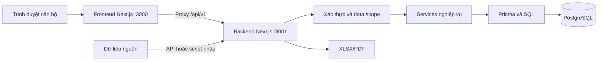
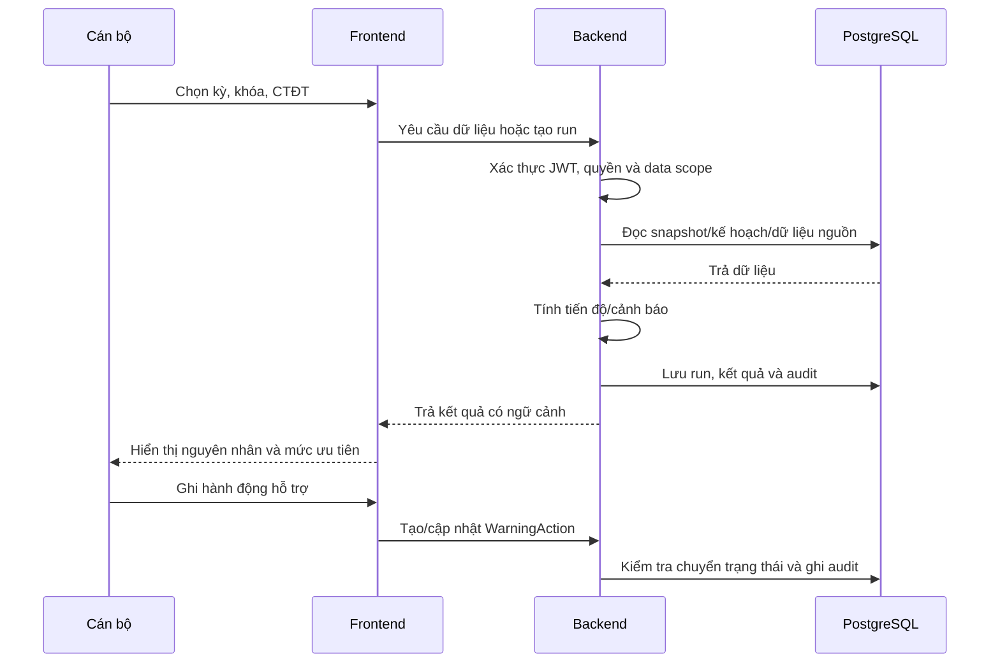

# BÁO CÁO CHI TIẾT HỆ THỐNG CẢNH BÁO SỚM SINH VIÊN

**Tên hệ thống:** SEWS - Student Early Warning System  
**Đơn vị sử dụng:** Khoa Công nghệ Thông tin, Trường Đại học Đà Lạt  
**Ngày lập báo cáo:** 21/09/2026  
**Phiên bản tài liệu:** 1.0  
**Căn cứ mã nguồn:** Kiến trúc SEWS phiên bản 4.4, cập nhật 20/09/2026

> Báo cáo này mô tả hiện trạng mã nguồn trong repository. Các nội dung được ghi là “đề xuất”, “định hướng” hoặc “giai đoạn sau” không được xem là chức năng đã nghiệm thu.

## 1. Tóm tắt điều hành

SEWS là hệ thống web hỗ trợ cán bộ quản lý và cố vấn học tập theo dõi tình hình học vụ, nhận diện sinh viên cần quan tâm, xem tiến độ chương trình đào tạo và ghi nhận hoạt động hỗ trợ. Hệ thống không tự thay thế quyết định học vụ, quyết định kỷ luật hoặc quyết định công nhận tốt nghiệp của nhà trường.

Sản phẩm hiện được tổ chức thành một npm monorepo gồm hai ứng dụng Next.js độc lập:

- **Frontend:** giao diện dashboard, hồ sơ sinh viên, quản lý học vụ, cảnh báo, dự kiến tốt nghiệp, RBAC và báo cáo.
- **Backend:** API Route Handlers, xác thực, phân quyền, giới hạn phạm vi dữ liệu, nghiệp vụ và truy cập PostgreSQL.
- **Cơ sở dữ liệu:** PostgreSQL được truy cập thông qua Prisma 6, có migration và seed.
- **Bảo mật:** JWT, refresh token trong HttpOnly cookie, bcrypt, kiểm tra Origin, RBAC, data scope và audit log.
- **Báo cáo:** xuất XLSX bằng ExcelJS và PDF bằng PDFKit/Noto Sans.

Các năng lực học vụ cốt lõi đã có nền tảng tương đối đầy đủ: hồ sơ sinh viên, lớp/khóa, chương trình đào tạo, học phần, điểm, đăng ký học phần, tiến độ, hoàn thành CTĐT, cảnh báo theo chính sách, nhật ký hỗ trợ và xuất báo cáo. Tuy nhiên, các nguồn dữ liệu rèn luyện/hoạt động ngoài học tập chưa đầy đủ; học máy chưa được triển khai; kết luận “đủ điều kiện tốt nghiệp” vẫn cần dữ liệu và xác nhận chính thức ngoài phạm vi học phần.

## 2. Mục tiêu và phạm vi

### 2.1. Mục tiêu

1. Tập trung dữ liệu học vụ phân tán thành hồ sơ thống nhất theo sinh viên, lớp, khóa, CTĐT và học kỳ.
2. Cho phép cán bộ xem nhanh các chỉ số học tập, đăng ký, tiến độ và cảnh báo.
3. Phát hiện các dấu hiệu cần theo dõi bằng các chính sách có phiên bản và đợt tính có thể truy vết.
4. Hỗ trợ cố vấn ghi nhận quá trình trao đổi, biện pháp hỗ trợ và trạng thái xử lý.
5. Cung cấp báo cáo phục vụ quản lý, rà soát và lưu trữ.
6. Tạo nền tảng dữ liệu cho nghiên cứu dự báo nguy cơ trong giai đoạn sau.

### 2.2. Phạm vi đã triển khai

- Quản lý sinh viên, lớp, khóa, năm học và học kỳ.
- Quản lý học phần và chương trình đào tạo.
- Nhập, xem và xuất dữ liệu điểm, đăng ký, quyết định và chính sách học phí.
- Quản lý kế hoạch tiến độ đào tạo có phiên bản.
- Chạy đối chiếu tiến độ đăng ký và đánh giá hoàn thành học phần.
- Chạy cảnh báo học vụ theo chính sách GPA, tiến độ và quyết định.
- Xem hồ sơ sinh viên và timeline dữ liệu liên quan.
- Ghi nhận hành động can thiệp/hỗ trợ.
- Đánh giá dự kiến tốt nghiệp theo phiên và bộ quy tắc.
- Quản lý người dùng, vai trò, quyền và phân công cố vấn.
- Dashboard, báo cáo cảnh báo và xuất XLSX/PDF.
- Audit các thao tác nhạy cảm như xuất báo cáo, thay đổi phân quyền và hỗ trợ.

### 2.3. Ngoài phạm vi phiên bản hiện tại

- Cổng đăng nhập riêng cho sinh viên hoặc phụ huynh.
- Nguồn dữ liệu hoạt động Đoàn - Hội được đồng bộ chính thức.
- Pipeline học máy, huấn luyện mô hình và suy luận nguy cơ tự động.
- Scheduler, worker queue hoặc dịch vụ gửi thông báo vận hành.
- Tự động ban hành quyết định cảnh báo, kỷ luật hoặc công nhận tốt nghiệp.
- Kết luận chính thức về tốt nghiệp chỉ dựa trên việc hoàn thành học phần.

## 3. Đối tượng sử dụng và phân quyền

| Đối tượng | Nhu cầu chính | Phạm vi dữ liệu |
| --- | --- | --- |
| Ban chủ nhiệm khoa | Theo dõi tổng thể, ưu tiên nguồn lực và xem báo cáo | Khoa hoặc phạm vi được cấp |
| Cố vấn/GVCN | Xem hồ sơ, rà soát cảnh báo và ghi nhận hỗ trợ | Lớp được phân công |
| Giáo vụ/chuyên viên | Quản lý dữ liệu đào tạo, nhập liệu và đối chiếu | Dữ liệu nghiệp vụ được giao |
| Cán bộ CTSV | Đối chiếu quyết định, rèn luyện và phối hợp hỗ trợ | Theo phân công |
| Quản trị viên | Quản lý tài khoản, quyền, cấu hình và audit | Toàn hệ thống nếu được cấp |
| Nhóm nghiên cứu | Chuẩn bị dữ liệu và đánh giá mô hình | Dữ liệu nghiên cứu được phép sử dụng |

Cơ chế quyền gồm `User`, `Role`, `Permission`, `UserRole`, `RolePermission` và `ClassAdvisorAssignment`. Backend kiểm tra quyền và phạm vi dữ liệu; frontend không được xem là lớp bảo vệ duy nhất.

Các phạm vi chính gồm `system`, `all_students`, `faculty` và `assigned_classes`. Tài khoản quản trị có cơ chế xử lý riêng. Người dùng chỉ có quyền báo cáo không mặc nhiên được đọc ghi chú tư vấn hoặc hồ sơ cá nhân chi tiết.

## 4. Kiến trúc tổng thể



### 4.1. Frontend

Frontend nằm trong `apps/frontend`, sử dụng Next.js 16.3.4, React 19, TypeScript, Tailwind CSS 4, Zustand, Recharts và Lucide React. Các nhóm giao diện chính gồm:

- Đăng nhập và xác thực phiên.
- Dashboard tổng quan.
- Danh sách và hồ sơ chi tiết sinh viên.
- Quản lý học vụ, CTĐT, học phần, lớp, khóa và kỳ.
- Tiến độ đào tạo và hoàn thành CTĐT.
- Cảnh báo và nhật ký hỗ trợ.
- Dự kiến tốt nghiệp.
- Quản trị RBAC.
- Báo cáo và xuất dữ liệu.

Frontend gọi API cùng origin thông qua `/api/v1`. `apps/frontend/proxy.ts` chuyển request tới `BACKEND_URL` tại runtime, giữ query, body và cookie. Vì vậy có thể đổi origin backend khi khởi động mà không phải build lại frontend.

### 4.2. Backend

Backend nằm trong `apps/backend`, cũng chạy trên Next.js Route Handlers tại cổng 3001. Route xử lý HTTP, kiểm tra phiên/quyền và gọi các service nghiệp vụ. Các service chính gồm:

- `academic-warnings.ts`: tính cảnh báo theo run và chính sách.
- `training-progress.ts`: đối chiếu đăng ký và hoàn thành kế hoạch.
- `student-training-progress.ts`: tổng hợp tiến độ theo sinh viên.
- `graduation-evaluations.ts` và `graduation-forecast.ts`: đánh giá dự kiến tốt nghiệp.
- `reports.ts`: tổng hợp báo cáo cảnh báo và kỳ báo cáo.
- `export.ts`: sinh workbook XLSX và tài liệu PDF.
- `grades.ts`: chuẩn hóa điểm, tín chỉ và khóa bản ghi nhập.
- `warning-actions.ts`: kiểm soát trạng thái nhật ký hỗ trợ.
- `audit.ts`: ghi nhận thao tác nhạy cảm.
- `conduct.ts`: phân loại và kiểm tra dữ liệu rèn luyện hiện có.

Frontend không import Prisma hoặc mã backend. Hợp đồng `/api/v1` được giữ ổn định để có thể thay đổi backend trong tương lai.

## 5. Công nghệ và cấu hình

| Thành phần | Công nghệ |
| --- | --- |
| Runtime | Node.js >= 20.9 |
| Repository | npm workspaces/monorepo |
| Frontend | Next.js 16.3.4, React 19.2.8, TypeScript |
| UI | Tailwind CSS 4, Lucide React, Recharts |
| Client state | Zustand |
| Backend | Next.js Route Handlers |
| Database | PostgreSQL |
| ORM | Prisma 6.11 |
| Authentication | jose, bcryptjs, JWT |
| Export | ExcelJS, PDFKit, Noto Sans |
| Test | Node.js test runner, tsx, smoke test |

Các biến môi trường quan trọng:

- `BACKEND_URL`: origin backend mà frontend server truy cập.
- `DATABASE_URL`: chuỗi kết nối PostgreSQL.
- `JWT_SECRET`: khóa ký JWT, tối thiểu 32 ký tự và chỉ đặt ở backend.
- `ALLOWED_ORIGINS`: danh sách Origin được phép gửi request ghi.
- `SEED_ADMIN_USERNAME` và `SEED_ADMIN_PASSWORD`: tài khoản seed quản trị.
- `SEED_ADVISOR_USERNAME` và `SEED_ADVISOR_PASSWORD`: tài khoản seed cố vấn.

## 6. Mô hình dữ liệu

### 6.1. Các miền dữ liệu

| Miền | Model tiêu biểu |
| --- | --- |
| Tổ chức đào tạo | `Student`, `Class`, `Cohort`, `AcademicYear`, `AcademicTerm` |
| Chương trình đào tạo | `TrainingProgram`, `Course`, `TrainingProgramCourse` |
| Đăng ký và điểm | `StudentCourseOffering`, `StudentCourseGrade` |
| Tổng hợp học tập | `StudentTermSummary`, `StudentCumulativeSummary` |
| Rèn luyện | `StudentConductRecord` |
| Nhập dữ liệu | `GradeImportBatch`, `GradeImportError`, `UnscopedGradeRecord` |
| Quyết định/học phí | `DecisionType`, `StudentDecision`, `FeePolicyType`, `StudentFeePolicy` |
| Tiến độ | `TrainingProgressPlan`, các model run và result |
| Cảnh báo | `AcademicWarningPolicy`, `AcademicWarningRun`, `AcademicWarningStudentResult`, `AcademicWarningReason` |
| Hỗ trợ | `WarningAction` |
| Bảo mật/audit | `User`, `Role`, `Permission`, `RefreshToken`, `AuditLog` |
| Dự kiến tốt nghiệp | `GraduationEvaluation`, `GraduationRule`, các model result/detail |

### 6.2. Nguyên tắc dữ liệu

- ID nội bộ khác mã nghiệp vụ nguồn, ví dụ `Student.id` khác mã sinh viên `sStudentId`.
- CTĐT phải gắn khóa/phiên bản; không áp dụng mặc định thông số của một khóa cho mọi khóa.
- Kết quả run lưu snapshot, hash và thời điểm chụp để có thể tái hiện kết luận.
- Dữ liệu thiếu, chờ điểm, không tính điểm và điểm 0 phải được phân biệt.
- Học lại không được cộng tín chỉ tích lũy nhiều lần.
- Không dùng tổng hợp tích lũy mới nhất để đánh giá lịch sử tại một kỳ cũ.
- Bản ghi nhập cần giữ nguồn, checksum và batch khi có thể.

## 7. Các phân hệ chức năng

### 7.1. Dashboard

Dashboard cung cấp số lượng sinh viên, phân bố cảnh báo, xu hướng GPA, tình trạng đăng ký/tiến độ và các danh sách cần chú ý. Kỳ báo cáo tự động loại kỳ hè, sau đó chọn kỳ chính gần nhất có độ phủ GPA học kỳ tối thiểu 80%; nếu chưa đạt, chọn kỳ chính gần nhất có dữ liệu.

Dashboard dùng hai nguồn có thể khác nhau: cảnh báo live từ dữ liệu GPA/quyết định và trạng thái tiến độ từ run gần nhất. Giao diện có `dataContext` để hiển thị kỳ, policy, run và thời điểm dữ liệu. Đây là điểm cần chú ý khi diễn giải số liệu: dashboard không phải lúc nào cũng là một snapshot đơn nhất.

### 7.2. Hồ sơ sinh viên

Hồ sơ sinh viên tập trung:

- Thông tin cá nhân, lớp, khóa và chương trình.
- GPA theo kỳ và GPA tích lũy.
- Tín chỉ, điểm và đăng ký học phần.
- Tiến độ CTĐT.
- Rèn luyện hiện có.
- Quyết định học vụ.
- Chính sách miễn giảm học phí.
- Cảnh báo và nhật ký hỗ trợ theo timeline.
- Nút xuất PDF hồ sơ sinh viên và các file dữ liệu được phép.

### 7.3. Quản lý học vụ và CTĐT

Cán bộ có thể quản lý năm học, học kỳ, khóa, lớp, học phần và CTĐT. Kế hoạch đào tạo hỗ trợ tạo phiên bản, clone, kích hoạt, khóa và lưu trữ. Kế hoạch đã khóa được xem là bất biến đối với các run đã tạo.

Dữ liệu có thể được nhập từ các endpoint import hoặc script đồng bộ Apidog. Script kiểm tra nguồn và script áp dụng dữ liệu là hai bước khác nhau; các script này không tự chạy khi cài đặt, build hoặc test.

### 7.4. Tiến độ đào tạo

Tiến độ đào tạo có hai trục:

1. **Đối chiếu đăng ký:** kiểm tra học phần bắt buộc, học phần tự chọn chỉ định, ngưỡng tín chỉ tự chọn và học phần ngoài kế hoạch.
2. **Đánh giá hoàn thành:** đối chiếu bằng chứng học phần đạt đến kỳ xét với kế hoạch CTĐT.

Các trạng thái chính:

- Tiến độ: `on_track`, `behind_schedule`, `pending_result`, `no_due_plan`, `data_error`.
- Hoàn thành: `completed`, `incomplete`, `cannot_determine`.

Chế độ `forecast` có thể giả định học phần đang đăng ký sẽ đạt, nhưng đây chỉ là kịch bản hoàn thành học phần, không phải mô hình học máy và không phải kết luận tốt nghiệp.

Giới hạn hiện tại: nhóm tự chọn mới được hỗ trợ trong phạm vi mô hình hiện có; yêu cầu “chọn N trong M”, tiên quyết, miễn trừ, tương đương và mọi ngoại lệ quy chế cần được cấu hình đầy đủ trước khi dùng cho kết luận chính thức.

### 7.5. Dự kiến tốt nghiệp

Mỗi phiên đánh giá tốt nghiệp lưu phạm vi, rule version, kết quả và chi tiết từng điều kiện. Năm trạng thái loại trừ nhau:

- `EXPECTED_ELIGIBLE`: dự kiến đủ theo các điều kiện đã có dữ liệu.
- `PENDING_GRADE`: còn chờ kết quả học tập.
- `PENDING_REQUIREMENT`: còn điều kiện ngoài học tập chưa xác minh.
- `NOT_ELIGIBLE`: có điều kiện đã xác định là không đạt.
- `MANUAL_REVIEW`: thiếu dữ liệu hoặc cần cán bộ kiểm tra thủ công.

Các điều kiện ngoài học phần như GDTC, GDQP-AN, ngoại ngữ, kỷ luật, pháp lý và rèn luyện toàn khóa phụ thuộc nguồn dữ liệu chính thức. Khi nguồn chưa có, hệ thống không tự mặc định đạt.

### 7.6. Cảnh báo học vụ

Bộ máy cảnh báo chạy theo `AcademicWarningRun` với `AcademicWarningPolicy` đang active. Các nguyên nhân hiện có:

| Mã | Ý nghĩa | Mức mặc định |
| --- | --- | --- |
| `REGISTRATION_BEHIND` | Đăng ký không đáp ứng kế hoạch | Trung bình |
| `PROGRAM_PROGRESS_BEHIND` | Tiến độ CTĐT chậm | Cao |
| `LOW_TERM_GPA` | GPA học kỳ dưới ngưỡng | Trung bình |
| `LOW_CUMULATIVE_GPA` | GPA tích lũy dưới ngưỡng | Cao |
| `ACADEMIC_WARNING_DECISION` | Có quyết định cảnh báo nguồn | Cao |

Mức chung lấy mức cao nhất: `none` tương ứng Xanh, `medium` tương ứng Vàng và `high` tương ứng Đỏ. GPA `null` không kích hoạt so sánh; thiếu dữ liệu phải được hiển thị riêng, không coi là an toàn.

Ngưỡng GPA là chính sách theo dõi nội bộ có phiên bản, không mặc nhiên là ngưỡng pháp lý hoặc quyết định chính thức của trường.

### 7.7. Rèn luyện và hoạt động

Hệ thống đã có `StudentConductRecord` và khả năng đọc dữ liệu tổng hợp hiện có. Tuy nhiên, trạng thái/phê duyệt, điểm công nhận, minh chứng và quy trình khiếu nại cần nguồn chính thức để kết luận đầy đủ.

Dữ liệu hoạt động Đoàn - Hội chưa có nguồn chính thức đủ tin cậy. Hệ thống hiện không dùng dữ liệu hoạt động để tạo cảnh báo và không tự cộng trọng số hoạt động vào điểm rèn luyện, tránh tính trùng hoặc suy diễn.

Kỳ hè được nhận diện bằng `AcademicTerm.sIsSummer`, không chỉ dựa vào mã kỳ. Kỳ hè được hiển thị riêng và không mặc nhiên dùng làm kỳ báo cáo chính hoặc run cảnh báo chính thức.

### 7.8. Nhật ký hỗ trợ

`WarningAction` lưu loại hành động, ghi chú, người thao tác, người phụ trách, hạn xử lý, thời điểm hoàn tất và trạng thái. Luồng trạng thái chính là:

`OPEN -> IN_PROGRESS -> RESOLVED`

Có hỗ trợ kiểm soát chuyển trạng thái, mở lại và optimistic concurrency theo nghiệp vụ hiện có. `RESOLVED` chỉ có nghĩa là hồ sơ hỗ trợ đã được xử lý, không có nghĩa sinh viên đã hết mọi nguyên nhân cảnh báo.

### 7.9. Báo cáo và xuất file

API xuất báo cáo hỗ trợ các loại cảnh báo, tiến độ, rèn luyện, hỗ trợ và hồ sơ sinh viên. Định dạng gồm XLSX và PDF tùy loại báo cáo. Mọi lần xuất phải kiểm tra quyền `report.export`, áp dụng data scope và ghi `report.export` vào audit log.

Các báo cáo cần ghi rõ kỳ, khóa/CTĐT, policy hoặc run, cutoff và độ phủ dữ liệu. Không nên dùng số lượng lý do cảnh báo làm mẫu số cho tỷ lệ xử lý hỗ trợ; mẫu số phải là số hồ sơ hỗ trợ thuộc đúng phạm vi.

## 8. API hiện có

API dùng base path `/api/v1`. Fixture kiểm tra hợp đồng hiện ghi nhận **147 phương thức API**, gồm:

| Nhóm | Chức năng |
| --- | --- |
| `/auth/*`, `/healthz` | Đăng nhập, refresh, logout, kiểm tra sức khỏe |
| `/students/*` | Hồ sơ, dashboard, điểm, đăng ký, quyết định, rèn luyện, học phí, xuất dữ liệu |
| `/classes`, `/cohorts`, `/academic-years` | Tổ chức đào tạo và ngữ cảnh học kỳ |
| `/courses`, `/training-programs` | Học phần và chương trình đào tạo |
| `/training-progress/*` | Kế hoạch, run đăng ký, run hoàn thành và kết quả |
| `/academic-warnings/*` | Chính sách, run cảnh báo, kết quả và hành động hỗ trợ |
| `/graduation-evaluations/*` | Preview, tạo phiên, xem kết quả và xuất |
| `/dashboard/summary`, `/reports/*` | Dashboard, báo cáo và xuất XLSX/PDF |
| `/rbac/*` | Người dùng, role, permission và phân công cố vấn |
| `/grades/import`, các endpoint import | Nhập dữ liệu nghiệp vụ |

API trả JSON trực tiếp, lỗi có `error.code` và `error.message`, có thể kèm request ID. Phân trang thường nhận `pageSize` hoặc `page_size`, mặc định 20 và tối đa 100 ở các route dùng helper.

## 9. Luồng nghiệp vụ tiêu biểu



Quy trình chuẩn:

1. Nhập hoặc đồng bộ dữ liệu theo năm học, kỳ, khóa và CTĐT.
2. Kiểm tra định danh, kỳ, trùng lặp và độ đầy đủ.
3. Xác nhận kế hoạch và policy có phiên bản.
4. Chạy đối chiếu đăng ký/hoàn thành.
5. Chạy cảnh báo theo cùng phạm vi và kỳ phù hợp.
6. Cán bộ xem bằng chứng, nguyên nhân và dữ liệu thiếu.
7. Ghi nhận hỗ trợ, theo dõi trạng thái và cập nhật khi có dữ liệu mới.
8. Xuất báo cáo với cutoff, phạm vi và nguồn tính rõ ràng.

## 10. Bảo mật và kiểm soát dữ liệu

- JWT được ký bằng `JWT_SECRET` chỉ tồn tại ở backend.
- Access/refresh token dùng HttpOnly cookie; production bật Secure và HTTPS.
- Refresh token có thời hạn dài hơn access token và được quản lý tại backend.
- Request ghi kiểm tra `Origin` theo `ALLOWED_ORIGINS`; không dùng wildcard `*`.
- Backend xác thực quyền và scope cho cả đọc, ghi, xóa và xuất dữ liệu.
- Mật khẩu được băm bằng bcryptjs.
- Audit log ghi người thao tác, resource, request ID và chi tiết phù hợp.
- Dữ liệu nghiên cứu cần dùng định danh thay thế và hạn chế thông tin nhận diện.
- Không đưa mật khẩu, token hoặc ghi chú tư vấn vào log công khai.
- Route xóa dữ liệu và các thay đổi RBAC phải được audit.

Các rủi ro cần duy trì kiểm soát: cấu hình JWT yếu, dùng tài khoản seed trong production, thiếu HTTPS, mở rộng scope quá mức, xuất báo cáo sai phạm vi và nhập dữ liệu nguồn chưa được phê duyệt.

## 11. Kiểm thử và vận hành

Các lệnh chính ở thư mục gốc:

```bash
npm ci
npm run db:generate
npm run db:deploy
npm run db:seed
npm run dev
npm run typecheck
npm run lint
npm test
npm run test:smoke
npm run build
```

- `npm run dev`: chạy frontend 3000 và backend 3001.
- `npm run build`: build cả hai ứng dụng.
- `npm test`: chạy test backend và kiểm tra hợp đồng endpoint.
- `npm run test:smoke`: kiểm tra HTTP khi hai server và database đang hoạt động.
- `npm run db:check-apidog`: kiểm tra dữ liệu nguồn mà chưa áp dụng.
- `npm run db:import-apidog`: áp dụng dữ liệu nguồn sau khi đã xác nhận database đích.
- `npm run db:sync-apidog-progress`: đồng bộ snapshot tiến độ.
- `npm run db:sync-apidog-graduation`: đồng bộ đánh giá dự kiến tốt nghiệp.

Test hiện có bao phủ auth/cookie/Origin, quyền, nhập điểm, tiến độ, hoàn thành, cảnh báo, state machine hỗ trợ, chữ ký file XLSX/PDF và hợp đồng API. Các nhóm nên tiếp tục mở rộng gồm dữ liệu trùng/lặp, học lại, tự chọn, kỳ hè, thiếu dữ liệu, nhiều CTĐT, scope ngoài lớp và kiểm thử khôi phục backup.

## 12. Hiện trạng, điểm mạnh và giới hạn

### 12.1. Điểm mạnh

- Kiến trúc frontend/backend tách biệt, hợp đồng API rõ.
- Có PostgreSQL, migration, Prisma và các script đồng bộ dữ liệu.
- Có phiên bản kế hoạch, policy, run, snapshot và hash để truy vết.
- Có RBAC và data scope ở backend.
- Có phân biệt cảnh báo theo quy tắc với dự kiến tốt nghiệp.
- Có audit cho thao tác nhạy cảm và xuất báo cáo.
- Có cơ chế xử lý kỳ hè riêng, tránh trộn kỳ phụ vào thống kê chính.
- Có nền tảng xuất báo cáo tiếng Việt bằng XLSX/PDF.

### 12.2. Giới hạn cần lưu ý

- Báo cáo live và cảnh báo theo run đang sử dụng hai nguồn tính khác nhau; cần giữ ngữ cảnh rõ hoặc chuẩn hóa sau.
- Một số quy tắc đào tạo phức tạp như tiên quyết, miễn trừ, tương đương và chọn N trong M chưa mô hình hóa đầy đủ.
- Dữ liệu rèn luyện ngoài học tập chưa đủ để tái dựng toàn bộ quy trình chính thức.
- Hoạt động ngoài lớp chưa có nguồn dữ liệu vận hành được xác nhận.
- Chưa có pipeline ML và chưa được phép gọi kết quả dự báo là quyết định chính thức.
- Chưa có scheduler/worker cho các đợt tính dài hoặc đồng bộ định kỳ.
- Chưa có cổng riêng cho sinh viên/phụ huynh.
- Các chỉ tiêu hiệu năng, độ chính xác và khả năng chịu tải chưa được đo đầy đủ trong báo cáo này.

## 13. Lộ trình đề xuất

### Giai đoạn 1: Hoàn thiện nghiệp vụ vận hành

1. Chuẩn hóa nguồn dữ liệu, cutoff và quy tắc nhập lại.
2. Hoàn thiện test cho học lại, tự chọn, miễn trừ, thiếu dữ liệu và kỳ hè.
3. Đồng nhất ngữ cảnh giữa dashboard, báo cáo live và warning run.
4. Bổ sung API/lịch sử run và công cụ rà soát lỗi dữ liệu.
5. Xác nhận nguồn rèn luyện, hoạt động và điều kiện tốt nghiệp ngoài học phần.

### Giai đoạn 2: Nâng chất lượng vận hành

1. Tách các đợt tính dài thành job có trạng thái, retry và idempotency.
2. Bổ sung giám sát, sao lưu, phục hồi thử nghiệm và nhật ký vận hành.
3. Đo hiệu năng API, thời gian xuất file và độ trễ dashboard trên dữ liệu thực.
4. Chuẩn hóa quy trình duyệt lô nhập đa nguồn.
5. Mở rộng báo cáo theo đơn vị, khóa, CTĐT và kỳ với quyền riêng.

### Giai đoạn 3: Nghiên cứu dự báo

1. Xác định nhãn cảnh báo và cutoff lịch sử.
2. Tạo snapshot đặc trưng không rò rỉ dữ liệu tương lai.
3. So sánh baseline với các mô hình ứng viên theo chia tập thời gian.
4. Đánh giá Precision, Recall, F1, PR-AUC và hiệu chỉnh xác suất khi đủ dữ liệu.
5. Hiển thị dự báo riêng với kỳ mục tiêu, phiên bản mô hình, thời điểm dữ liệu và giải thích.
6. Không ghi đè cảnh báo quy tắc hoặc tự tạo quyết định chính thức từ dự báo.

## 14. Kết luận

SEWS đã hình thành một nền tảng quản lý và cảnh báo học vụ có cấu trúc rõ, bao phủ phần lớn quy trình từ dữ liệu nguồn, hồ sơ sinh viên, tính tiến độ, cảnh báo, hỗ trợ đến báo cáo. Kiến trúc monorepo hai ứng dụng Next.js, PostgreSQL/Prisma, RBAC và cơ chế run/snapshot giúp hệ thống có khả năng mở rộng và truy vết tốt.

Để đưa hệ thống vào vận hành chính thức, ưu tiên trước mắt là xác nhận nguồn dữ liệu và quy chế áp dụng theo từng khóa, đồng nhất ngữ cảnh của các báo cáo, hoàn thiện các ngoại lệ CTĐT và kiểm thử trên dữ liệu thực. Các nhãn “cảnh báo”, “dự kiến đủ điều kiện” và “đã hỗ trợ” phải tiếp tục được tách khỏi quyết định chính thức của nhà trường.

Học máy nên được triển khai sau khi dữ liệu lịch sử, nhãn, cutoff và quy trình quản trị dữ liệu đã đáng tin cậy. Khi đó, mô hình sẽ đóng vai trò hỗ trợ ưu tiên can thiệp, không thay thế cán bộ hoặc cơ quan có thẩm quyền.

## 15. Tài liệu tham chiếu

- [README dự án](../README.md)
- [Kiến trúc và nghiệp vụ hệ thống](ARCHITECTURE.md)
- [Báo cáo hoàn thành dự án](PROJECT_REPORT.md)
- [Hướng dẫn sử dụng](USER_GUIDE.md)
- [Schema Prisma](../apps/backend/prisma/schema.prisma)
- [Hướng dẫn migration](../apps/backend/prisma/MIGRATIONS.md)
- [Danh sách phương thức API](../apps/backend/tests/fixtures/api-operations.json)
- [Kiến trúc và đặc tả tiến độ đào tạo](ARCHITECTURE.md#46-ánh-xạ-đặc-tả-tiến-độ-đào-tạo-s6)
- [Thiết kế dự kiến tốt nghiệp](thiet-ke-chuc-nang-du-kien-sinh-vien-tot-nghiep.md)
