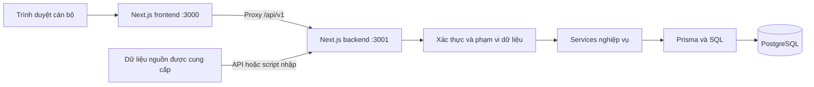

# Báo Cáo Chi Tiết Dự Án: Hệ Thống Cảnh Báo Sớm Học Vụ Sinh Viên (SEWS)

## 1. Thông Tin Chung
- **Tên dự án**: SEWS — Student Early Warning System
- **Đơn vị thụ hưởng**: Khoa Công nghệ Thông tin, Trường Đại học Đà Lạt.
- **Phiên bản kiến trúc hiện tại**: 4.4 (Cập nhật 20/09/2026)
- **Phạm vi ưu tiên hiện tại**: Hoàn thiện và kiểm chứng các chức năng học vụ (hồ sơ, dữ liệu điểm/đăng ký/quyết định, tiến độ đào tạo, cảnh báo theo quy tắc, nhật ký hỗ trợ, phân quyền và báo cáo). Chức năng Học máy (ML) và dự báo nguy cơ được thiết kế để triển khai trong giai đoạn nghiên cứu khoa học tiếp theo.

## 2. Kiến Trúc Hệ Thống
Hệ thống áp dụng kiến trúc phần mềm **Client-Server** và được tổ chức theo cấu trúc **npm monorepo** gồm 2 ứng dụng độc lập:

- **Frontend (Giao diện người dùng)**: Được xây dựng bằng Next.js 16.3.4, React 19.2.8, sử dụng Tailwind CSS 4 cho UI và Zustand để quản lý state. Giao diện người dùng giao tiếp với backend thông qua Proxy `/api/v1`. Chạy tại port `3000`.
- **Backend (API và Nghiệp vụ)**: Được xây dựng bằng Next.js Route Handlers. Tách biệt rõ ràng các tầng giao tiếp HTTP, xử lý nghiệp vụ (Services), xác thực quyền truy cập và tương tác cơ sở dữ liệu. Chạy tại port `3001`.
- **Persistence (Lưu trữ CSDL)**: Sử dụng hệ quản trị CSDL **PostgreSQL** kết hợp ORM **Prisma 6**. Prisma quản lý Schema và đảm bảo tính nhất quán dữ liệu qua Migration.
- **Xác thực và Bảo mật**: Xác thực thông qua JWT (`jose`, `bcryptjs`) và lưu trữ an toàn với HttpOnly cookies, cơ chế xác thực Origin và phân quyền RBAC.

### Sơ đồ luồng dữ liệu cơ bản:

## 3. Cấu Trúc Database (Mô Hình Dữ Liệu)
CSDL được chia thành các miền nghiệp vụ cụ thể để đảm bảo linh hoạt:

1. **Tổ chức đào tạo & CTĐT**: `Student`, `Class`, `Cohort`, `AcademicYear`, `AcademicTerm`, `TrainingProgram`, `Course`.
2. **Đăng ký & Điểm**: `StudentCourseOffering`, `StudentCourseGrade`, `StudentTermSummary`, `StudentCumulativeSummary`.
3. **Tiến độ & Hoàn thành CTĐT**: 
   - Kế hoạch: `TrainingProgressPlan`, `TrainingProgressPlanCourse`.
   - Đối chiếu: Đợt đánh giá đăng ký (`TrainingProgressCalculationRun`) và đợt đánh giá hoàn thành CTĐT (`TrainingProgressCompletionRun`) cùng các bản ghi kết quả cho từng sinh viên/học phần.
4. **Cảnh báo học vụ**: 
   - Chính sách cảnh báo: `AcademicWarningPolicy`.
   - Kết quả cảnh báo: `AcademicWarningRun`, `AcademicWarningStudentResult`, `AcademicWarningReason`.
5. **Hỗ trợ sinh viên (Nhật ký)**: `WarningAction` lưu lại quy trình thao tác hỗ trợ giữa cán bộ - sinh viên.
6. **Xác thực và Phân quyền (RBAC)**: `User`, `Role`, `Permission`, `UserRole`, `RolePermission`, `ClassAdvisorAssignment`, `AuditLog`.

## 4. Các Phân Hệ Chức Năng Chính
### 4.1. Tiến độ đào tạo & Đánh giá mức độ hoàn thành
- **Tiến độ (Progress)**: Đối chiếu kế hoạch đăng ký của sinh viên. Phân loại theo các ngưỡng `on_track`, `behind_schedule`, `pending_result` dựa vào số tín chỉ đạt / chưa đạt.
- **Hoàn thành CTĐT (Completion)**: Đánh giá hoàn thành so với chương trình đào tạo của khóa/ngành (Bắt buộc, Tự chọn, Nhóm tự chọn). 
- Hệ thống hỗ trợ lấy Snapshot tại các đợt (Runs), giữ lại version lịch sử để có thể kiểm chứng nguyên nhân. Cung cấp Giao diện phân tích đa chiều (Cây yêu cầu).

### 4.2. Dự kiến tốt nghiệp (Graduation Forecast)
- Chức năng đánh giá tổng quan: Chạy phiên đánh giá để xác định dự báo dựa trên điểm tích lũy, các chứng chỉ quy định (GDTC, GDQP, Ngoại ngữ).
- Sinh viên được xếp vào 5 loại trạng thái: `EXPECTED_ELIGIBLE`, `PENDING_GRADE`, `PENDING_REQUIREMENT`, `NOT_ELIGIBLE`, `MANUAL_REVIEW`.

### 4.3. Cảnh báo Học vụ & Quản lý Nhật ký hỗ trợ
- Hệ thống cảnh báo tự động tính toán sinh viên bị lỗi nhịp học và vi phạm GPA. Các mã nguyên nhân nổi bật gồm: `LOW_TERM_GPA`, `LOW_CUMULATIVE_GPA`, `REGISTRATION_BEHIND`, `PROGRAM_PROGRESS_BEHIND`.
- Mức độ cảnh báo: `Xanh` (an toàn), `Vàng` (mức trung bình), `Đỏ` (mức cao, ưu tiên theo dõi sát sao).
- **Hỗ trợ/Nhật ký (WarningAction)**: Cố vấn học tập (CVHT) vào nhận định, viết phản hồi lý do thực tế, đánh dấu trạng thái quá trình (OPEN, IN_PROGRESS, RESOLVED).

### 4.4. Báo cáo & Dashboard
- Dashboard phân tích thời gian thực tổng quan, lấy kỳ đủ 80% độ phủ điểm làm kỳ báo cáo tự động (loại bỏ kỳ hè).
- Cho phép xuất file PDF/XLSX bằng `ExcelJS` và `PDFKit`. Việc xuất dữ liệu sẽ được ghi nhận vào `AuditLog` để tuân thủ quy tắc bảo mật dữ liệu nguồn.

## 5. Hướng Phát Triển Tương Lai (Kiến trúc Machine Learning)
Theo yêu cầu đề tài NCKH giai đoạn sau, hệ thống sẽ được tích hợp pipeline học máy dự báo sớm nguy cơ:
- **Bài toán**: Ước lượng nguy cơ sinh viên nhận cảnh báo học vụ ở học kỳ kế tiếp.
- **Dữ liệu đặc trưng (Features)**: GPA xu hướng, nợ tín chỉ, môn học lại, hoạt động ngoại khóa.
- **Kiến trúc**: Pipeline huấn luyện dự kiến sẽ nằm ngoài Next.js. Có thể triển khai trên môi trường Python (như FastAPI, Redis, Worker queues).
- **Sản phẩm**: API suy luận và dashboard dự báo nguy cơ cho phép CVHT hành động sớm trước khi điểm số thành quyết định chính thức.

## 6. Vận Hành & Môi Trường
- **Cấu hình yêu cầu**: Node.js >= 20.9, PostgreSQL. 
- **Lệnh Start**: Khởi chạy qua hệ sinh thái lệnh script monorepo (`npm run dev`, `npm run build`).
- Hệ thống có hỗ trợ tập lệnh Unit/Smoke Test vững vàng (`npm run test`, `npm run test:smoke`) để đảm bảo logic API/Auth không bị gãy khi cập nhật mới. Lệnh `npm run db:seed` tạo dữ liệu mô phỏng, người dùng và phân quyền ban đầu.
