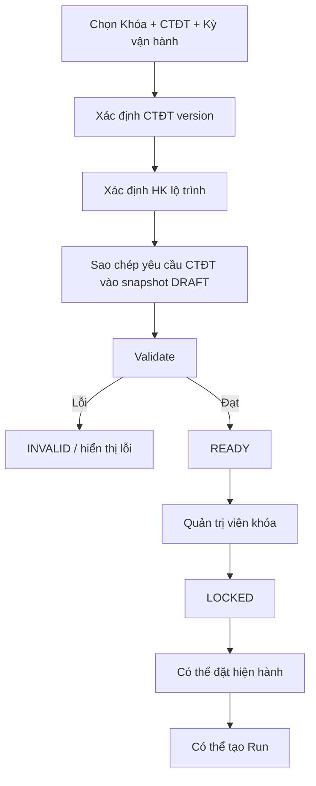
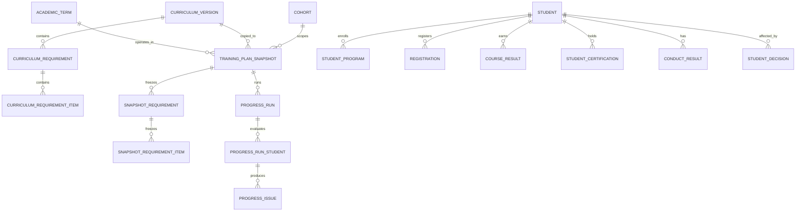

# THIẾT KẾ CHI TIẾT CHỨC NĂNG **TIẾN ĐỘ ĐÀO TẠO**

> **Hệ thống:** Portal CNTT – Trường Đại học Đà Lạt  
> **Phân hệ:** Đào tạo → Tiến độ đào tạo  
> **Đối tượng chính:** Quản trị viên / Phòng – Khoa phụ trách đào tạo  
> **Mức tài liệu:** Functional Specification + Business Rules + Data/API Design  
> **Phạm vi giao diện tham chiếu:** màn hình `Tiến độ đào tạo` với 2 tab `Kiểm tra đăng ký` và `Hoàn thành CTĐT`.

---

## 1. Mục tiêu chức năng

Chức năng **Tiến độ đào tạo** dùng để kiểm soát tiến độ học tập theo **đúng phiên bản chương trình đào tạo (CTĐT)** và theo **kỳ vận hành thực tế**, đồng thời tạo ra kết quả đối soát có thể truy vết tại thời điểm kiểm tra.

Chức năng giải quyết 2 bài toán khác nhau nhưng dùng chung một nền dữ liệu:

1. **Kiểm tra đăng ký theo kỳ**
   - Đối chiếu học phần sinh viên đã đăng ký trong một kỳ vận hành với kế hoạch CTĐT đã được khóa bằng snapshot.
   - Phân biệt rõ:
     - **lệch lộ trình CTĐT**; và
     - **vi phạm/không thỏa điều kiện theo quy chế**.
   - Không được coi mọi trường hợp “không học đúng môn theo học kỳ mẫu” là vi phạm quy chế.

2. **Kiểm tra hoàn thành CTĐT**
   - Đối chiếu toàn bộ kết quả đã tích lũy của sinh viên với yêu cầu của CTĐT áp dụng cho sinh viên đó.
   - Cho biết sinh viên:
     - đã hoàn thành yêu cầu nào;
     - còn thiếu yêu cầu nào;
     - đang bị chặn bởi điều kiện nào;
     - có dữ liệu nào chưa đủ để kết luận.
   - Kết quả hệ thống chỉ là **đánh giá điều kiện sơ bộ**, không thay thế quyết định xét và công nhận tốt nghiệp của Hội đồng/Hiệu trưởng.

---

## 2. Tài liệu “luật cứng” sử dụng làm nguồn quy tắc

### 2.1. CTĐT Công nghệ Thông tin 2020 – K44

File: `2020_CTDT_K44.pdf`

Các nội dung được dùng trực tiếp:

- Thời gian thiết kế: **4 năm**.
- Khối lượng toàn khóa của CTĐT CNTT: **150 tín chỉ**, không tính Giáo dục thể chất và Giáo dục quốc phòng – an ninh vào tổng 150.
- Cơ cấu tối thiểu:
  - **104 tín chỉ bắt buộc**;
  - **46 tín chỉ tự chọn**.
- Kế hoạch giảng dạy được tổ chức theo **HK1 → HK8**.
- Có các nhóm tự chọn yêu cầu “chọn ít nhất N tín chỉ”.
- Có học phần theo chuyên ngành.
- Có quan hệ học phần tiên quyết.
- Sinh viên phải hoàn thành các thành phần bắt buộc của chương trình, trong đó tài liệu nêu rõ **Thực tập nghề nghiệp** và **Đồ án tốt nghiệp**.
- Điều kiện tốt nghiệp của CTĐT có thêm:
  - chứng chỉ Giáo dục thể chất;
  - chứng chỉ Giáo dục quốc phòng;
  - chuẩn đầu ra ngoại ngữ.

### 2.2. Quy chế đào tạo theo hệ thống tín chỉ

File: `1.QuyCheDaoTaoTheoHeThongTinChi.docx`

Các quy tắc dùng trong module:

- Khối lượng học tập đăng ký theo học kỳ.
- Cách xác định tín chỉ tích lũy.
- Điểm A/B/C/D được tính là đã tích lũy; F không tích lũy.
- Điều kiện tiên quyết phải được thỏa khi đăng ký học phần.
- Quy định khối lượng đăng ký tối thiểu/tối đa theo tình trạng học lực.
- Học phần bắt buộc bị F phải học lại; học phần tự chọn bị F có thể học lại hoặc thay bằng học phần tự chọn tương đương.
- Học phần D có thể học lại/cải thiện theo quy định.
- Xếp hạng năm đào tạo dựa trên số tín chỉ tích lũy.
- Học kỳ phụ được xử lý riêng và kết quả được gộp theo quy định khi xếp hạng học lực.
- GPA tích lũy phục vụ xét tốt nghiệp phải đạt tối thiểu **2.00**.
- Điều kiện xét tốt nghiệp còn phụ thuộc trạng thái kỷ luật/pháp lý và các điều kiện riêng của chương trình.

### 2.3. Quy định đánh giá kết quả rèn luyện DLU

File: `99-QD-DHDL_240216-Qui-dinh-danh-gia-ket-qua-ren-luyen.pdf`

Các nội dung liên quan trực tiếp đến tiến độ đào tạo:

- Kết quả rèn luyện được đánh giá theo học kỳ, năm học và toàn khóa.
- Kết quả rèn luyện toàn khóa được sử dụng làm căn cứ trong một số hoạt động cuối khóa và được ghi cùng kết quả học tập theo quy định.
- Sinh viên có kết quả rèn luyện yếu/kém trong hai học kỳ liên tiếp có thể bị tạm ngừng học; nếu lặp lại theo quy định có thể bị buộc thôi học.
- Hoạt động của học kỳ hè đối với rèn luyện được quy về học kỳ chính theo quy định riêng của rèn luyện.

> **Nguyên tắc triển khai:** không tự suy diễn một “mức điểm rèn luyện tối thiểu để tốt nghiệp” nếu tài liệu nguồn không quy định trực tiếp. Hệ thống chỉ áp dụng các ngưỡng/điều kiện rèn luyện đã có căn cứ cấu hình hoặc quyết định chính thức.

---

## 3. Nguyên tắc ưu tiên quy tắc

Hệ thống phải có cơ chế ưu tiên quy tắc để tránh hard-code sai giữa quy định chung và CTĐT cụ thể.

Thứ tự ưu tiên đề xuất:

1. **Quyết định cá nhân đã có hiệu lực**
   - công nhận tương đương;
   - miễn học;
   - bảo lưu;
   - chuyển chương trình;
   - đình chỉ;
   - thôi học;
   - quyết định khác có ảnh hưởng trực tiếp tới sinh viên.
2. **CTĐT/version áp dụng cho sinh viên**.
3. **Quy chế đào tạo chung**.
4. **Quy định rèn luyện**.
5. **Cấu hình vận hành của hệ thống**, với điều kiện không được trái nguồn 1–4.

### 3.1. Ví dụ bắt buộc xử lý đúng

Quy chế chung có thể đưa ra ngưỡng tối thiểu chung cho chương trình đại học 4 năm, nhưng **CTĐT CNTT K44 2020 quy định cụ thể 150 tín chỉ**. Vì vậy:

```text
Không được hard-code: đại học 4 năm = 120 tín chỉ là đủ.

Phải tính:
required_total_credits = curriculum_version.total_required_credits

Đối với CTĐT CNTT K44 2020:
required_total_credits = 150
```

---

## 4. Khái niệm nghiệp vụ

### 4.1. Khóa

Khóa tuyển sinh của sinh viên, ví dụ K44, K45, K46...

### 4.2. Chương trình đào tạo

Chương trình/ngành/chuyên ngành mà sinh viên theo học.

Một khóa có thể gắn với nhiều phiên bản CTĐT trong trường hợp có quyết định chuyển đổi hoặc cập nhật.

### 4.3. Kỳ vận hành

Kỳ thời gian thực tế hệ thống đang xử lý, ví dụ:

```text
2026-2027 / Học kỳ 1
2026-2027 / Học kỳ 2
2026-2027 / Học kỳ hè
```

### 4.4. Học kỳ lộ trình

Vị trí học kỳ trong CTĐT thiết kế:

```text
HK1, HK2, HK3, ... HK8
```

`Kỳ vận hành` và `HK lộ trình` là hai khái niệm độc lập.

Ví dụ một sinh viên khóa cũ học lại môn HK3 trong kỳ vận hành 2026-2027/HK1 không có nghĩa kỳ vận hành đó trở thành “HK3”.

### 4.5. Snapshot

Snapshot là bản chụp **bất biến** của kế hoạch/yêu cầu CTĐT được dùng tại một thời điểm vận hành.

Snapshot phải lưu đủ dữ liệu để một lần chạy cũ có thể được tái hiện dù CTĐT nguồn sau đó đã thay đổi.

Snapshot bao gồm ít nhất:

- khóa;
- CTĐT;
- version CTĐT;
- kỳ vận hành;
- HK lộ trình;
- học phần bắt buộc;
- nhóm tự chọn và số tín chỉ tối thiểu;
- học phần tiên quyết;
- quy tắc tương đương;
- số tín chỉ chương trình;
- các điều kiện phi tín chỉ;
- thời điểm khóa;
- người khóa;
- checksum/hash cấu hình.

### 4.6. Run

Một lần hệ thống thực thi đối soát dựa trên:

```text
Snapshot + dữ liệu sinh viên + dữ liệu đăng ký/kết quả tại thời điểm chạy
```

Run phải được lưu lịch sử và không được ghi đè.

---

## 5. Phân quyền

### 5.1. Quản trị viên đào tạo

Có quyền:

- xem toàn bộ kế hoạch;
- tạo snapshot;
- chỉnh snapshot khi còn `DRAFT`;
- validate;
- khóa snapshot;
- đặt snapshot hiện hành;
- chạy kiểm tra;
- xem kết quả chi tiết;
- xuất báo cáo;
- xem lịch sử run.

### 5.2. Cán bộ khoa được phân quyền

Có thể được giới hạn theo khoa/ngành:

- xem;
- chạy kiểm tra;
- xem kết quả;
- không sửa quy tắc gốc nếu không có quyền.

### 5.3. Tài khoản chỉ đọc

- chỉ xem dashboard, snapshot, run và báo cáo.

### 5.4. Quy tắc RBAC

Mọi thao tác thay đổi snapshot, khóa/mở khóa, đặt hiện hành hoặc chạy lại phải có audit log:

```text
actor_id
actor_role
action
target_type
target_id
before_value
after_value
reason
created_at
ip/device metadata (nếu có)
```

---

# PHẦN A — THIẾT KẾ GIAO DIỆN TỔNG

## 6. Bố cục trang

Trang giữ đúng cấu trúc giao diện tham chiếu:

```text
Tiến độ đào tạo
Kiểm tra đăng ký theo kỳ và hoàn thành yêu cầu học phần CTĐT bằng snapshot.

[ Kiểm tra đăng ký ] [ Hoàn thành CTĐT ]
```

Hai tab dùng chung bộ nguyên tắc:

- dữ liệu có version;
- chạy bằng snapshot;
- kết quả có lịch sử;
- không lấy CTĐT “live” để thay đổi kết quả của một run cũ.

---

## 7. Trạng thái kỳ học hiện tại

Nếu danh mục đào tạo chưa xác định kỳ hiện tại, hiển thị banner giống giao diện:

> **Chưa xác định kỳ học hiện tại**  
> Cần đánh dấu năm học và học kỳ hiện tại trong danh mục đào tạo để highlight đúng phạm vi kiểm tra.

### 7.1. Hành vi khi chưa có kỳ hiện tại

Cho phép:

- xem snapshot cũ;
- lọc dữ liệu;
- mở run cũ;
- xem kết quả.

Không cho phép:

- tự động chọn “kỳ hiện tại”;
- chạy tác vụ dựa trên `CURRENT_TERM`;
- tự gán HK lộ trình.

Cho phép quản trị viên chạy thủ công nếu họ chọn kỳ vận hành cụ thể.

### 7.2. Ràng buộc dữ liệu

Trong cùng một hệ đào tạo, tại một thời điểm chỉ có tối đa:

```text
1 academic_year.is_current = true
1 academic_term.is_current = true
```

Nếu phát hiện > 1 kỳ hiện tại → trạng thái dữ liệu `INVALID_CONFIGURATION`.

---

# PHẦN B — TAB 1: KIỂM TRA ĐĂNG KÝ

## 8. Mục tiêu tab `Kiểm tra đăng ký`

Đối chiếu đăng ký của sinh viên với snapshot kế hoạch đã khóa cho kỳ vận hành.

Kết quả phải trả lời 4 câu hỏi:

1. Sinh viên đang đăng ký những học phần nào?
2. Theo CTĐT/lộ trình, kỳ này dự kiến học những học phần nào?
3. Đăng ký hiện tại có thỏa các điều kiện cứng của quy chế không?
4. Có sai lệch nào cần cán bộ đào tạo xem xét?

---

## 9. Thanh công cụ đầu card

### 9.1. `Mở run gần đây`

Dropdown hiển thị tối đa N run gần nhất theo scope hiện tại.

Mỗi item:

```text
#RUN-20260920-001
K44 • CNTT 2020 • 2026-2027/HK1
20/09/2026 12:35
SUCCESS • 1.234 SV • 87 cảnh báo
```

Khi chọn:

- mở trang/drawer chi tiết run;
- giữ nguyên kết quả đã lưu;
- không tự chạy lại.

### 9.2. `Làm mới`

Chỉ reload dữ liệu danh sách và trạng thái mới nhất.

Không được tự tạo run mới.

---

## 10. Bộ lọc

### 10.1. Khóa

Cho phép:

- tất cả;
- 1 khóa cụ thể.

Ví dụ:

```text
K44
K45
K46
```

### 10.2. Chương trình đào tạo

Hiển thị theo quyền truy cập của tài khoản.

Option nên gồm:

```text
Tên CTĐT
Mã ngành
Version
Trạng thái áp dụng
```

### 10.3. `Đặt lại`

Reset về:

```text
Khóa = Tất cả
CTĐT = Tất cả
Các filter nâng cao = mặc định
Trang = 1
```

Không thay đổi kỳ hiện tại của hệ thống.

---

## 11. Các counter phía trên bảng

Theo giao diện:

- `Tổng N Kế hoạch`
- `N hiện hành trong trang`
- `N thuộc kỳ hiện tại trong trang`
- `N đã khóa trong trang`

### 11.1. Định nghĩa

**Tổng kế hoạch**  
Tổng số snapshot/kế hoạch khớp filter hiện tại.

**Hiện hành trong trang**  
Số row có `is_current = true` trong page đang xem.

**Thuộc kỳ hiện tại trong trang**  
Số row có `operation_term_id = current_term_id`.

**Đã khóa trong trang**  
Số row có `status = LOCKED`.

> Counter ghi “trong trang” phải thực sự đếm page hiện tại, không dùng total toàn bộ dataset.

---

## 12. Bảng kế hoạch

Các cột giữ theo giao diện:

| Cột | Nội dung |
|---|---|
| Khóa / CTĐT | Khóa, tên chương trình, chuyên ngành nếu có |
| Kỳ vận hành | Năm học + học kỳ vận hành |
| HK lộ trình | HK1–HK8 hoặc trạng thái đặc biệt |
| Version | Version snapshot/CTĐT |
| Trạng thái | DRAFT/READY/LOCKED/ARCHIVED/INVALID |
| Lượt chạy | Tổng run đã thực hiện trên snapshot |
| Hiện hành | Có/Không |
| Vận hành | Menu thao tác |

### 12.1. Nội dung ô `Khóa / CTĐT`

Ví dụ:

```text
K44
Công nghệ Thông tin
Kỹ thuật phần mềm
```

### 12.2. `Kỳ vận hành`

Ví dụ:

```text
2026-2027
Học kỳ 1
```

### 12.3. `HK lộ trình`

Giá trị hợp lệ:

```text
HK1 ... HK8
HÈ
BỔ SUNG
KHÔNG ÁNH XẠ
```

Không tự ép học kỳ hè thành một HK lộ trình chính nếu chưa có mapping chính thức.

### 12.4. `Version`

Nên thể hiện 2 cấp nếu cần:

```text
CTĐT: 2020.1
Snapshot: v3
```

### 12.5. `Trạng thái`

#### `DRAFT`

- đang chỉnh sửa;
- chưa được dùng chạy chính thức.

#### `READY`

- validate thành công;
- chưa khóa.

#### `LOCKED`

- bất biến;
- được phép chạy chính thức.

#### `ARCHIVED`

- không còn hiện hành;
- vẫn xem được run lịch sử.

#### `INVALID`

- dữ liệu có lỗi;
- không được chạy.

### 12.6. `Lượt chạy`

Hiển thị số run hợp lệ:

```text
12
```

Click → lịch sử run.

### 12.7. `Hiện hành`

Dùng badge hoặc radio/toggle.

Ràng buộc:

```text
Trong cùng (khóa + CTĐT + kỳ vận hành), tối đa 1 snapshot hiện hành.
```

Snapshot hiện hành phải ở trạng thái `LOCKED`.

---

## 13. Menu `Vận hành`

Các action đề xuất:

### Với `DRAFT`

- Xem chi tiết
- Chỉnh sửa
- Validate
- Xóa bản nháp

### Với `READY`

- Xem chi tiết
- Chỉnh sửa
- Khóa snapshot
- Nhân bản version mới

### Với `LOCKED`

- Xem chi tiết
- Đặt hiện hành
- Chạy kiểm tra đăng ký
- Mở lịch sử run
- Nhân bản thành version mới
- Archive

### Không cho phép

- sửa trực tiếp snapshot đã khóa;
- xóa snapshot đã có run;
- thay nội dung một run đã hoàn thành.

---

## 14. Quy trình tạo snapshot



---

## 15. Validate snapshot trước khi khóa

Tối thiểu kiểm tra:

1. Có khóa.
2. Có CTĐT/version.
3. Có kỳ vận hành.
4. Có HK lộ trình hoặc lý do hợp lệ nếu không ánh xạ.
5. Tất cả mã học phần tồn tại.
6. Mỗi học phần có số tín chỉ hợp lệ.
7. Nhóm tự chọn có `min_credits`.
8. `min_credits` không lớn hơn tổng tín chỉ có thể chọn trong nhóm.
9. Quan hệ tiên quyết không tạo cycle.
10. Học phần tương đương không tự tham chiếu.
11. Không có một học phần bắt buộc bị khai báo đồng thời như “chỉ tự chọn” trong cùng scope nếu không có rule giải thích.
12. Tổng cấu trúc tín chỉ khớp metadata CTĐT.
13. CTĐT K44 2020 phải kiểm tra được cấu hình 150/104/46 theo tài liệu nguồn.
14. Giáo dục thể chất và Giáo dục quốc phòng không bị cộng nhầm vào tổng 150 của CTĐT này.
15. Có nguồn rule/version để audit.

---

# PHẦN C — ENGINE KIỂM TRA ĐĂNG KÝ

## 16. Dữ liệu đầu vào một run

```text
snapshot_id
operation_term_id
student_scope
registration_cutoff_time
source_data_version
requested_by
requested_at
```

Cho mỗi sinh viên:

```text
student_program
student_curriculum_version
academic_status
cumulative_credits
cumulative_gpa
registered_courses
passed_courses
failed_courses
prerequisite_results
approved_equivalences
leave/suspension status
```

---

## 17. Hai lớp kết quả bắt buộc tách riêng

### 17.1. Lớp A — `ROADMAP_ALIGNMENT`

Đánh giá mức độ bám lộ trình CTĐT.

Ví dụ:

- thiếu học phần dự kiến;
- học sớm học phần của kỳ sau;
- đăng ký học phần ngoài HK lộ trình;
- tự chọn chưa đúng nhóm dự kiến.

Đây **không mặc định là vi phạm quy chế**.

### 17.2. Lớp B — `REGULATION_VALIDITY`

Đánh giá điều kiện cứng:

- tiên quyết;
- khối lượng tín chỉ tối thiểu/tối đa;
- trạng thái học lực;
- điều kiện đăng ký;
- trạng thái đình chỉ/ngừng học;
- các rule cứng khác.

---

## 18. Rule kiểm tra đăng ký

Mỗi rule phải có:

```text
rule_code
rule_name
rule_type = LAW | CURRICULUM | OPERATIONAL
severity = ERROR | WARNING | INFO
source_document
source_section
version
active_from
active_to
parameters
```

### `REG-PREREQ-001` — Tiên quyết

Nếu học phần X yêu cầu Y là tiên quyết:

```pseudo
if X in current_registrations
and not prerequisite_satisfied(Y):
    ERROR REG_PREREQUISITE_UNSATISFIED
```

Không chỉ kiểm tra “đã từng đăng ký Y”; phải kiểm tra điều kiện hoàn thành theo định nghĩa rule tương ứng.

### `REG-CREDIT-001` — Tối thiểu học kỳ chính, học lực bình thường

Theo file quy chế đã cung cấp:

```pseudo
if term.type == MAIN
and student.academic_rank == NORMAL
and not final_semester_exception
and registered_credits < 14:
    ERROR/WARNING REG_CREDIT_BELOW_MIN_NORMAL
```

Mức severity có thể cấu hình theo cách DLU vận hành thực tế, nhưng engine phải lưu rule nguồn.

### `REG-CREDIT-002` — Tối thiểu học kỳ chính, học lực yếu

```pseudo
if term.type == MAIN
and student.academic_rank == WEAK
and not final_semester_exception
and registered_credits < 10:
    issue REG_CREDIT_BELOW_MIN_WEAK
```

### `REG-CREDIT-003` — Tối đa khi học lực yếu

```pseudo
if term.type == MAIN
and student.academic_rank == WEAK
and registered_credits > 14:
    issue REG_CREDIT_ABOVE_MAX_WEAK
```

### `REG-CREDIT-004` — Học kỳ phụ

Không áp dụng khối lượng tối thiểu theo rule của file quy chế nguồn.

```pseudo
if term.type == SUMMER:
    skip minimum_credit_rule
```

### `REG-RETAKE-001` — Học phần bắt buộc F

Học phần bắt buộc có F vẫn là nghĩa vụ chưa hoàn thành.

Không được tự kết luận “vi phạm trong kỳ này” chỉ vì sinh viên chưa đăng ký lại ngay kỳ kế tiếp, nếu quy định nguồn chỉ yêu cầu đăng ký lại trong một học kỳ tiếp theo.

Kết quả phù hợp hơn:

```text
ADVISORY / OUTSTANDING_REQUIRED_COURSE
```

### `REG-RETAKE-002` — Học phần tự chọn F

Cho phép:

- học lại chính học phần đó; hoặc
- học học phần tự chọn tương đương hợp lệ.

### `REG-IMPROVE-001` — Học phần D

Học phần D đã được tích lũy nhưng có thể xuất hiện trong danh sách cải thiện điểm nếu có đăng ký lại hợp lệ.

Không được xóa tín chỉ tích lũy cũ chỉ vì sinh viên đang học cải thiện.

---

## 19. Rule đối chiếu lộ trình

### `PLAN-MISSING-001`

Học phần bắt buộc nằm trong HK lộ trình nhưng sinh viên không đăng ký.

Kết quả:

```text
WARNING
category = ROADMAP_ALIGNMENT
```

Không tự gán `ERROR` theo luật nếu vẫn thỏa quy chế đăng ký.

### `PLAN-EARLY-001`

Sinh viên đăng ký học phần của HK sau.

Nếu đủ tiên quyết:

```text
INFO = học vượt / lệch lộ trình nhưng hợp lệ
```

Nếu thiếu tiên quyết:

```text
ERROR = vi phạm điều kiện tiên quyết
```

### `PLAN-OUTSIDE-001`

Học phần không thuộc CTĐT/version của sinh viên.

Phân loại:

1. có mapping tương đương/học phần bổ sung được duyệt → hợp lệ;
2. học cải thiện/học lại → hợp lệ theo ngữ cảnh;
3. chưa có căn cứ → `NEEDS_REVIEW`.

---

## 20. Học kỳ hè

Hệ thống phải tách 3 khái niệm:

```text
operation_term = kỳ hè thực tế
academic_ranking_bucket = học kỳ chính được dùng khi xếp hạng học lực
conduct_bucket = học kỳ chính dùng khi đánh giá rèn luyện
```

Không dùng một field `merged_semester` cho cả ba nghiệp vụ.

Theo các file nguồn đã cung cấp:

- kết quả học tập học kỳ phụ có quy tắc gộp riêng khi xếp hạng học lực;
- nội dung rèn luyện học kỳ hè có quy tắc quy về học kỳ chính riêng.

Do đó schema nên có:

```text
academic_terms.academic_result_merge_target_id
academic_terms.conduct_merge_target_id
```

Hai field có thể trỏ tới hai kỳ khác nhau.

---

## 21. Kết quả một sinh viên trong run đăng ký

Ví dụ payload logic:

```json
{
  "studentId": "...",
  "roadmap": {
    "expectedCredits": 19,
    "registeredCredits": 16,
    "missingPlannedCourses": 1,
    "extraCourses": 0,
    "status": "DEVIATED"
  },
  "regulation": {
    "status": "VALID",
    "errors": 0,
    "warnings": 1
  },
  "issues": []
}
```

### 21.1. Trạng thái tổng

```text
PASS
WARNING
ERROR
NEEDS_REVIEW
NOT_APPLICABLE
```

Thứ tự ưu tiên:

```text
ERROR > NEEDS_REVIEW > WARNING > PASS
```

---

## 22. Màn hình chi tiết Run đăng ký

### Header

- Run ID
- Snapshot
- Khóa
- CTĐT
- kỳ vận hành
- HK lộ trình
- trạng thái run
- thời gian chạy
- người chạy
- hash snapshot

### KPI

- tổng sinh viên;
- pass;
- warning;
- error;
- cần đối soát;
- tổng issue.

### Filter

- mã sinh viên;
- tên;
- lớp;
- trạng thái;
- issue code;
- học phần;
- chuyên ngành.

### Bảng

| MSSV | Sinh viên | TC đăng ký | TC lộ trình | Lệch lộ trình | Lỗi quy chế | Cần đối soát | Trạng thái |
|---|---|---:|---:|---:|---:|---:|---|

Click sinh viên → drawer chi tiết.

---

# PHẦN D — TAB 2: HOÀN THÀNH CTĐT

## 23. Mục tiêu

Tab này đánh giá **mức hoàn thành CTĐT toàn khóa** theo snapshot/version của từng sinh viên.

Không dùng thuật ngữ `Đã tốt nghiệp` cho kết quả engine.

Dùng:

```text
Đủ điều kiện sơ bộ
Chưa đủ điều kiện
Cần đối soát
Thiếu dữ liệu
```

Quyết định tốt nghiệp là nghiệp vụ khác.

---

## 24. Bộ lọc đề xuất

- Khóa
- CTĐT
- Chuyên ngành
- Lớp
- Trạng thái sinh viên
- Trạng thái hoàn thành
- Nhóm điều kiện còn thiếu
- Khoảng tín chỉ tích lũy
- Khoảng GPA

---

## 25. KPI tab `Hoàn thành CTĐT`

- Tổng sinh viên trong scope
- Đủ điều kiện sơ bộ
- Chưa đủ tín chỉ
- Thiếu học phần bắt buộc
- Thiếu tự chọn
- Thiếu chứng chỉ/chuẩn đầu ra
- GPA chưa đạt
- Có chặn hành chính/kỷ luật
- Cần đối soát dữ liệu

---

## 26. Bảng tổng hợp

| Cột | Ý nghĩa |
|---|---|
| MSSV / Sinh viên | Định danh |
| CTĐT / Version | CTĐT áp dụng |
| TC tích lũy | Credits được công nhận |
| Bắt buộc | x / required |
| Tự chọn | x / required |
| GPA | GPA tích lũy |
| GDTC | Đạt/Thiếu |
| GDQP | Đạt/Thiếu |
| Ngoại ngữ | Đạt/Thiếu/Chưa có dữ liệu |
| Rèn luyện / hành chính | Bình thường/Cảnh báo/Chặn/Cần đối soát |
| Điều kiện còn thiếu | số blocker |
| Kết luận sơ bộ | trạng thái |

---

## 27. Cây yêu cầu CTĐT của một sinh viên

Drawer chi tiết nên hiển thị dạng cây:

```text
CTĐT Công nghệ Thông tin K44 – Version 2020
├── Tổng tín chỉ: 147 / 150   ❌
├── Bắt buộc: 104 / 104       ✅
├── Tự chọn: 43 / 46          ❌
│   ├── Đại cương tự chọn: 15 / 15 ✅
│   ├── Chuyên ngành: 22 / 25 ❌
│   └── Bổ trợ: 6 / 6         ✅
├── Thực tập nghề nghiệp      ✅
├── Đồ án tốt nghiệp          ⏳
├── GDTC                       ✅
├── GDQP                       ✅
├── Chuẩn đầu ra ngoại ngữ    ❌
├── GPA tích lũy: 2.74         ✅
└── Trạng thái hành chính      ✅
```

Mỗi node click được để xem:

- học phần đã dùng để đáp ứng requirement;
- học phần dư;
- học phần tương đương;
- nguồn rule;
- lý do pass/fail.

---

# PHẦN E — ENGINE HOÀN THÀNH CTĐT

## 28. Nguyên tắc tính tín chỉ tích lũy

### 28.1. Học phần đạt

Theo quy chế nguồn, học phần có kết quả A/B/C/D được tính vào khối lượng kiến thức tích lũy.

### 28.2. Học phần F

Không được tính tín chỉ hoàn thành.

### 28.3. Học lại / học cải thiện

Không được cộng trùng tín chỉ cho cùng một nghĩa vụ CTĐT.

Ví dụ:

```text
Môn A = 3 TC
Sinh viên học A hai lần và đều có kết quả đạt
=> completion credits cho requirement A vẫn chỉ = 3 TC
```

### 28.4. Học phần tương đương

Một học phần chỉ được dùng thay thế nếu có mapping tương đương có hiệu lực đối với đúng:

- khóa;
- CTĐT;
- version;
- thời gian;
- hoặc quyết định cá nhân.

---

## 29. Rule CTĐT CNTT K44 2020

### `CTDT-K44-TOTAL-001`

```pseudo
program_credits >= 150
```

Không cộng các tín chỉ GDTC và GDQP vào `program_credits` của rule 150.

### `CTDT-K44-REQUIRED-001`

```pseudo
required_credits >= 104
and all mandatory requirements satisfied
```

Không chỉ kiểm tra tổng 104; phải kiểm tra cả từng nghĩa vụ bắt buộc.

Ví dụ sai nếu chỉ tính tổng:

```text
Sinh viên thiếu một môn bắt buộc 3 TC
nhưng học thêm 3 TC tự chọn
=> tổng tín chỉ vẫn đủ
=> vẫn CHƯA hoàn thành bắt buộc.
```

### `CTDT-K44-ELECTIVE-001`

```pseudo
elective_credits_used >= 46
```

Đồng thời từng nhóm tự chọn con phải đạt `min_credits` tương ứng.

### `CTDT-K44-PE-001`

```pseudo
physical_education_certificate == VALID
```

GDTC là điều kiện riêng, không cộng vào 150.

### `CTDT-K44-DEFENSE-001`

```pseudo
national_defense_certificate == VALID
```

GDQP là điều kiện riêng, không cộng vào 150.

### `CTDT-K44-LANGUAGE-001`

```pseudo
language_outcome_status == SATISFIED
```

Không hard-code loại chứng chỉ/ngưỡng điểm nếu 3 file nguồn hiện tại chưa mô tả chi tiết chuẩn đầu ra ngoại ngữ.

Chuẩn cụ thể phải lấy từ cấu hình/nguồn quy định tương ứng.

### `CTDT-K44-INTERNSHIP-001`

Thực tập nghề nghiệp phải hoàn thành nếu học phần này là bắt buộc trong snapshot áp dụng.

### `CTDT-K44-CAPSTONE-001`

Đồ án tốt nghiệp phải hoàn thành nếu snapshot áp dụng quy định đây là nghĩa vụ bắt buộc.

---

## 30. Rule GPA và tốt nghiệp

### `GRAD-GPA-001`

```pseudo
cumulative_gpa >= 2.00
```

### `GRAD-STATUS-001`

Tại thời điểm đánh giá, nếu sinh viên đang thuộc trạng thái hành chính làm mất điều kiện xét tốt nghiệp theo quy chế, kết quả:

```text
NOT_ELIGIBLE / ADMINISTRATIVE_BLOCK
```

Không tự suy luận từ ghi chú tự do; phải dựa trên trạng thái/quyết định có cấu trúc.

### `GRAD-DECISION-001`

Engine không được tự chuyển trạng thái thành `GRADUATED`.

Chỉ có thể trả:

```text
PRELIMINARY_ELIGIBLE
NOT_ELIGIBLE
NEEDS_REVIEW
MISSING_DATA
```

---

## 31. Rèn luyện trong completion engine

Rèn luyện phải là một **dimension độc lập**, không trộn với GPA.

Dữ liệu nên gồm:

```text
semester_conduct_scores
semester_conduct_classifications
whole_program_conduct_score
whole_program_conduct_classification
conduct_decision_status
```

### 31.1. Không tạo rule không có nguồn

Không viết:

```pseudo
if conduct_score < 50 => không được tốt nghiệp
```

nếu chưa có quy định nguồn trực tiếp xác nhận ngưỡng đó là điều kiện tốt nghiệp.

### 31.2. Rule liên quan ngừng học/thôi học

Nếu hệ thống đã có quyết định chính thức dựa trên quy định rèn luyện:

```text
TEMPORARILY_SUSPENDED
EXPELLED
```

thì completion engine phải đưa trạng thái đó vào block hành chính.

### 31.3. Trường hợp cần đối soát

Nếu tài liệu quy định nói rèn luyện toàn khóa là căn cứ cho một bước cuối khóa nhưng hệ thống chưa có rule định lượng tương ứng:

```text
NEEDS_REVIEW: CONDUCT_FINAL_REVIEW_REQUIRED
```

Không tự “pass” hoặc “fail” thay cán bộ.

---

## 32. Phân bổ học phần vào nhóm requirement

Một học phần đạt có thể khớp nhiều nhóm về mặt kỹ thuật. Engine phải tránh double count.

### Chiến lược

1. Ưu tiên requirement bắt buộc cụ thể.
2. Sau đó nhóm tự chọn hẹp/chuyên ngành.
3. Sau đó nhóm tự chọn rộng.
4. Một course result chỉ cấp credit cho một requirement bucket, trừ khi CTĐT ghi rõ được phép dùng kép.

Pseudo-code:

```pseudo
remaining_results = passed_results

for requirement in requirements.sorted_by_priority:
    matches = find_eligible_results(requirement, remaining_results)
    allocated = allocate_until_minimum(requirement, matches)
    mark_used(allocated)
```

Cần lưu bảng allocation để giải thích kết quả.

---

## 33. Kết luận completion

### `PRELIMINARY_ELIGIBLE`

Chỉ khi:

```pseudo
all hard academic requirements == PASS
and all configured graduation requirements == PASS
and no administrative blocker
and no unresolved mandatory data
```

### `NOT_ELIGIBLE`

Có ít nhất một hard blocker đã xác định chắc chắn.

Ví dụ:

- thiếu học phần bắt buộc;
- thiếu số tín chỉ tối thiểu;
- GPA < 2.00;
- thiếu chứng chỉ bắt buộc;
- chưa đạt chuẩn ngoại ngữ;
- đang bị đình chỉ theo trạng thái chính thức.

### `NEEDS_REVIEW`

Có xung đột hoặc trường hợp cần quyết định con người:

- học phần chưa có mapping tương đương;
- dữ liệu chuyển trường;
- quyết định miễn học chưa số hóa đầy đủ;
- rule rèn luyện cuối khóa chưa đủ thông tin;
- CTĐT/version không xác định chắc chắn.

### `MISSING_DATA`

Thiếu dữ liệu bắt buộc để chạy:

- thiếu bảng điểm;
- thiếu CTĐT mapping;
- thiếu version;
- thiếu trạng thái chứng chỉ;
- nguồn dữ liệu đang lỗi.

---

# PHẦN F — DATA MODEL

## 34. Mô hình dữ liệu lõi



---

## 35. `academic_terms`

```text
id
academic_year_id
code
name
term_type               MAIN_1 | MAIN_2 | SUMMER | OTHER
start_date
end_date
is_current
academic_result_merge_target_id nullable
conduct_merge_target_id nullable
created_at
updated_at
```

---

## 36. `curriculum_versions`

```text
id
program_id
version_code
cohort_from
cohort_to
valid_from
valid_to
designed_semesters
total_program_credits
required_credits_min
elective_credits_min
pe_counted_in_program_credits boolean
defense_counted_in_program_credits boolean
status
source_document_id
```

Ví dụ K44 CNTT 2020:

```text
designed_semesters = 8
total_program_credits = 150
required_credits_min = 104
elective_credits_min = 46
pe_counted_in_program_credits = false
defense_counted_in_program_credits = false
```

---

## 37. `curriculum_requirements`

```text
id
curriculum_version_id
parent_id nullable
code
name
type
    REQUIRED_COURSE
    ELECTIVE_GROUP
    CREDIT_TOTAL
    CERTIFICATE
    GPA_MINIMUM
    INTERNSHIP
    CAPSTONE
    LANGUAGE_OUTCOME
    CUSTOM
min_courses nullable
min_credits nullable
roadmap_semester nullable
specialization_id nullable
priority
```

---

## 38. `curriculum_requirement_items`

```text
id
requirement_id
course_id nullable
equivalence_group_id nullable
credits
is_mandatory
valid_from
valid_to
```

---

## 39. `course_prerequisites`

```text
id
curriculum_version_id
course_id
prerequisite_course_id
condition_type
    PASSED
    COMPLETED
    MIN_GRADE
    CO_REQUISITE
min_grade nullable
```

Không giả định mọi “tiên quyết” đều cùng một semantics nếu dữ liệu gốc sau này phân biệt tiên quyết/song hành/học trước.

---

## 40. `training_plan_snapshots`

```text
id
cohort_id
program_id
curriculum_version_id
operation_term_id
roadmap_semester
snapshot_version
status
is_current
config_hash
created_by
created_at
validated_at
locked_by nullable
locked_at nullable
archived_at nullable
```

Unique đề xuất:

```text
UNIQUE(cohort_id, program_id, operation_term_id, snapshot_version)
```

Partial unique:

```text
at most one is_current = true
for (cohort_id, program_id, operation_term_id)
```

---

## 41. `snapshot_requirements`

Là bản copy bất biến của `curriculum_requirements` tại thời điểm khóa.

Không FK logic “live” khiến thay CTĐT nguồn làm thay nội dung snapshot cũ.

Nên lưu cả:

```text
source_requirement_id
source_version
frozen_payload_json
```

---

## 42. `progress_runs`

```text
id
run_code
run_type                  REGISTRATION | COMPLETION
snapshot_id
status                    QUEUED | RUNNING | SUCCESS | PARTIAL | FAILED | CANCELLED
source_data_cutoff
source_data_version
requested_by
started_at
finished_at
student_count
pass_count
warning_count
error_count
review_count
engine_version
rule_set_version
error_message nullable
```

---

## 43. `progress_run_students`

```text
id
run_id
student_id
status
registered_credits nullable
roadmap_credits nullable
accumulated_credits nullable
required_credits_done nullable
elective_credits_done nullable
cumulative_gpa nullable
blocker_count
warning_count
result_payload_json
```

---

## 44. `progress_issues`

```text
id
run_student_id
rule_code
category
severity
course_id nullable
requirement_id nullable
message
actual_value_json
expected_value_json
source_rule_id
is_resolved
resolution_note nullable
```

---

## 45. `requirement_allocations`

Dùng cho completion explainability:

```text
id
run_student_id
requirement_id
course_result_id
credits_used
allocation_order
reason
```

Cho phép trả lời chính xác:

> “3 tín chỉ môn X đang được tính vào nhóm nào?”

---

# PHẦN G — API DESIGN

## 46. API danh sách kế hoạch

```http
GET /api/training-progress/plans
```

Query:

```text
cohortId
programId
termId
status
isCurrent
page
pageSize
```

Response cần trả counters cùng lúc để tránh frontend tự đếm sai.

---

## 47. API tạo snapshot

```http
POST /api/training-progress/snapshots
```

Body:

```json
{
  "cohortId": "...",
  "programId": "...",
  "curriculumVersionId": "...",
  "operationTermId": "...",
  "roadmapSemester": 5
}
```

---

## 48. API validate

```http
POST /api/training-progress/snapshots/{snapshotId}/validate
```

Response:

```json
{
  "valid": false,
  "errors": [],
  "warnings": []
}
```

---

## 49. API khóa snapshot

```http
POST /api/training-progress/snapshots/{snapshotId}/lock
```

Yêu cầu:

- snapshot đang READY;
- người dùng có quyền;
- transaction;
- sinh `config_hash`;
- ghi audit log.

---

## 50. API đặt hiện hành

```http
POST /api/training-progress/snapshots/{snapshotId}/set-current
```

Trong transaction:

1. kiểm tra snapshot LOCKED;
2. unset snapshot hiện hành cũ cùng scope;
3. set snapshot mới;
4. audit.

---

## 51. API chạy kiểm tra đăng ký

```http
POST /api/training-progress/snapshots/{snapshotId}/runs/registration
```

Body tùy chọn:

```json
{
  "studentIds": [],
  "dataCutoff": "2026-09-20T13:00:00+07:00"
}
```

Nếu danh sách rỗng → chạy toàn bộ scope hợp lệ.

---

## 52. API chạy completion

```http
POST /api/training-progress/snapshots/{snapshotId}/runs/completion
```

Có thể cho phép completion snapshot cấp CTĐT thay vì gắn đúng một kỳ, nhưng vẫn phải version hóa rule set.

---

## 53. API lịch sử run

```http
GET /api/training-progress/runs
GET /api/training-progress/runs/{runId}
GET /api/training-progress/runs/{runId}/students
GET /api/training-progress/runs/{runId}/students/{studentId}
```

---

## 54. API requirement tree sinh viên

```http
GET /api/training-progress/students/{studentId}/requirements
    ?snapshotId=...
    &runId=...
```

Ưu tiên trả dữ liệu từ `runId` nếu user đang xem run cũ.

Không recompute bằng dữ liệu live rồi hiển thị dưới danh nghĩa run cũ.

---

# PHẦN H — THUẬT TOÁN

## 55. Thuật toán kiểm tra đăng ký

```pseudo
function evaluateRegistration(student, snapshot, term):
    result = new EvaluationResult()

    if not student.isApplicableTo(snapshot):
        return NOT_APPLICABLE

    actual = getEffectiveRegistrations(student, term)
    expected = snapshot.getRoadmapRequirements()

    // A. Lộ trình
    result.roadmapIssues += compareExpectedAndActual(expected, actual)

    // B. Điều kiện tiên quyết
    for registration in actual:
        prereqs = snapshot.getPrerequisites(registration.course)
        if not satisfy(student, prereqs):
            result.add(ERROR, "REG_PREREQUISITE_UNSATISFIED")

    // C. Khối lượng tín chỉ
    credits = sumCredits(actual)
    applyCreditLoadRules(student, term, credits, result)

    // D. Học lại / tương đương
    evaluateRetakesAndEquivalences(student, actual, snapshot, result)

    // E. Trạng thái hành chính
    evaluateAdministrativeEligibility(student, term, result)

    return result.finalize()
```

---

## 56. Thuật toán completion

```pseudo
function evaluateCompletion(student, curriculumSnapshot):
    result = new CompletionResult()

    results = normalizeCourseResults(student.transcript)
    passed = results.filter(grade in [A, B, C, D])

    passed = applyApprovedEquivalences(passed, student)
    allocations = allocatePassedCoursesToRequirements(
        passed,
        curriculumSnapshot.requirements
    )

    checkMandatoryCourses(allocations, result)
    checkRequiredCreditBuckets(allocations, result)
    checkElectiveBuckets(allocations, result)
    checkTotalProgramCredits(allocations, result)

    checkInternship(result)
    checkCapstone(result)
    checkPECertificate(student, result)
    checkDefenseCertificate(student, result)
    checkLanguageOutcome(student, result)

    checkGPA(student, result)
    checkAdministrativeStatus(student, result)
    checkConductStatus(student, result)

    if result.hasMissingMandatoryData:
        return MISSING_DATA

    if result.hasUnresolvedReviewItem:
        return NEEDS_REVIEW

    if result.hasHardBlocker:
        return NOT_ELIGIBLE

    return PRELIMINARY_ELIGIBLE
```

---

# PHẦN I — VERSIONING VÀ TÍNH TÁI LẬP

## 57. Quy tắc bất biến

Sau khi snapshot `LOCKED`:

```text
KHÔNG UPDATE requirement trực tiếp.
KHÔNG UPDATE prerequisite trực tiếp.
KHÔNG UPDATE min credit trực tiếp.
KHÔNG UPDATE CTĐT version gắn snapshot.
```

Muốn thay đổi:

```text
Clone snapshot → version mới → validate → lock → set current.
```

---

## 58. Run phải tái lập được

Mỗi run lưu:

```text
snapshot_hash
rule_set_version
engine_version
data_cutoff
source_data_version
```

Khi mở run lịch sử, UI hiển thị:

> Kết quả này được tính theo dữ liệu và rule tại thời điểm chạy. Dữ liệu hiện tại có thể đã thay đổi.

Có nút riêng:

```text
[Chạy lại với dữ liệu hiện tại]
```

Nút này tạo **run mới**, không sửa run cũ.

---

# PHẦN J — CÁC TÌNH HUỐNG BIÊN

## 59. Sinh viên chuyển khóa/chuyển chương trình

Phải xác định:

- CTĐT gốc;
- CTĐT mới;
- ngày hiệu lực;
- kết quả được bảo lưu;
- mapping tương đương;
- quyết định áp dụng.

Nếu thiếu quyết định/mapping:

```text
NEEDS_REVIEW
```

Không tự gán CTĐT theo khóa hiện tại.

---

## 60. Đổi mã học phần

Ví dụ môn cũ A101 được thay bằng A201.

Không sửa transcript cũ.

Tạo:

```text
course_equivalence_group
```

và rule hiệu lực theo CTĐT/version.

---

## 61. Một học phần xuất hiện ở nhiều nhóm tự chọn

Mặc định chỉ được tính cho **một** nhóm để tránh double count.

Nếu quy định cho phép dùng chung phải có flag cụ thể:

```text
allow_double_count = true
```

Không mặc định true.

---

## 62. Sinh viên học vượt

Nếu:

- học phần thuộc CTĐT;
- đủ tiên quyết;
- đăng ký hợp lệ;

thì:

```text
ROADMAP_ALIGNMENT = INFO/DEVIATED
REGULATION_VALIDITY = PASS
```

Không coi học vượt là lỗi chỉ vì khác HK lộ trình.

---

## 63. Sinh viên học chậm

Thiếu môn trong kỳ mẫu:

```text
WARNING: ROADMAP_MISSING_PLANNED_COURSE
```

Nếu tổng tín chỉ đăng ký vẫn hợp lệ và không có điều kiện bắt buộc khác bị vi phạm thì không tạo `REGULATION_ERROR`.

---

## 64. Học kỳ cuối

Các rule có ngoại lệ “trừ học kỳ cuối khóa” phải dùng một hàm xác định rõ:

```pseudo
isFinalSemester(student, curriculumVersion, operationTerm)
```

Không chỉ dựa vào `roadmap_semester == 8`, vì sinh viên có thể học kéo dài.

Cần xác định theo chính sách dữ liệu DLU, ví dụ còn số nghĩa vụ ít hơn ngưỡng hoặc kỳ dự kiến cuối đã được xác nhận.

Nếu không xác định chắc chắn → `NEEDS_REVIEW`, không tự áp dụng ngoại lệ.

---

## 65. Điểm/chứng chỉ chưa cập nhật

Nếu nguồn chính thức chưa có dữ liệu:

```text
MISSING_DATA
```

Không coi `null = không đạt` một cách mặc định.

Phải phân biệt:

```text
PASSED
FAILED
NOT_RECORDED
NOT_APPLICABLE
```

---

# PHẦN K — MÃ LỖI / CẢNH BÁO

## 66. Registration issue codes

```text
REG_PREREQUISITE_UNSATISFIED
REG_CREDIT_BELOW_MIN_NORMAL
REG_CREDIT_BELOW_MIN_WEAK
REG_CREDIT_ABOVE_MAX_WEAK
REG_STUDENT_NOT_ACTIVE
REG_TERM_NOT_CONFIGURED
REG_PROGRAM_MISMATCH
REG_DUPLICATE_EQUIVALENT_COURSE

PLAN_MISSING_PLANNED_REQUIRED
PLAN_EXTRA_COURSE
PLAN_EARLY_COURSE
PLAN_ELECTIVE_GROUP_DEVIATION

DATA_CURRICULUM_VERSION_MISSING
DATA_EQUIVALENCE_UNRESOLVED
DATA_REGISTRATION_INCONSISTENT
```

---

## 67. Completion issue codes

```text
COMP_TOTAL_CREDITS_SHORT
COMP_REQUIRED_COURSE_MISSING
COMP_REQUIRED_CREDITS_SHORT
COMP_ELECTIVE_CREDITS_SHORT
COMP_ELECTIVE_GROUP_SHORT
COMP_INTERNSHIP_INCOMPLETE
COMP_CAPSTONE_INCOMPLETE
COMP_GPA_BELOW_MINIMUM
COMP_PE_CERTIFICATE_MISSING
COMP_DEFENSE_CERTIFICATE_MISSING
COMP_LANGUAGE_OUTCOME_MISSING
COMP_ADMINISTRATIVE_BLOCK
COMP_CONDUCT_REVIEW_REQUIRED
COMP_CURRICULUM_UNRESOLVED
COMP_TRANSCRIPT_MISSING
```

---

# PHẦN L — AUDIT VÀ GIẢI THÍCH KẾT QUẢ

## 68. Mọi issue phải giải thích được

Ví dụ không hiển thị chung chung:

```text
Không đủ điều kiện.
```

Phải hiển thị:

```text
COMP_ELECTIVE_GROUP_SHORT
Nhóm: Kiến thức chuyên ngành tự chọn
Yêu cầu: 25 TC
Đã được phân bổ: 22 TC
Còn thiếu: 3 TC
Nguồn: CTĐT CNTT 2020 / nhóm B2
```

---

## 69. Trace rule

Click `Nguồn quy tắc` mở panel:

```text
Rule code
Tên rule
Loại rule
Nguồn tài liệu
Điều/Mục
Version rule
Tham số áp dụng
Ngày hiệu lực
```

Mục tiêu: cán bộ có thể biết **vì sao hệ thống kết luận như vậy**.

---

# PHẦN M — YÊU CẦU PHI CHỨC NĂNG

## 70. Hiệu năng

Đề xuất mục tiêu:

- danh sách kế hoạch: < 1 giây với filter thông thường;
- mở run cũ: < 2 giây cho metadata/KPI;
- chi tiết sinh viên: < 1 giây khi đã materialize run;
- run lớn: xử lý background job;
- frontend polling hoặc SSE/WebSocket cho trạng thái run.

Không giữ request HTTP đồng bộ nhiều phút.

---

## 71. Tính nhất quán

Các thao tác sau phải transactional:

- set snapshot hiện hành;
- lock snapshot;
- finalize run;
- ghi allocation + result + issue.

---

## 72. Idempotency

API tạo run nhận `Idempotency-Key`.

Tránh double-click tạo 2 run trùng nhau.

---

## 73. Bảo mật

- RBAC theo khoa/chương trình.
- Không expose toàn bộ bảng điểm cho role không được phép.
- Log export dữ liệu sinh viên.
- Không cho client tự truyền rule rồi backend tin trực tiếp.
- Rule phải được resolve ở server.

---

## 74. Timezone

Dùng timezone nghiệp vụ:

```text
Asia/Ho_Chi_Minh
```

Lưu DB bằng UTC nếu kiến trúc hệ thống thống nhất như vậy, nhưng mọi cutoff nghiệp vụ phải hiển thị rõ timezone.

---

# PHẦN N — ACCEPTANCE CRITERIA

## 75. AC-01 — Chưa có kỳ hiện tại

**Given** chưa cấu hình năm học/học kỳ hiện tại  
**When** mở `Tiến độ đào tạo`  
**Then** hiện banner cảnh báo  
**And** không highlight row thuộc kỳ hiện tại  
**And** vẫn xem được snapshot/run cũ.

---

## 76. AC-02 — Snapshot đã khóa không được sửa

**Given** snapshot ở `LOCKED`  
**When** user gọi API update requirement  
**Then** trả lỗi `409 SNAPSHOT_IMMUTABLE`.

---

## 77. AC-03 — Chỉ một snapshot hiện hành

**Given** đã có snapshot A hiện hành cho `(K44, CNTT, 2026-2027/HK1)`  
**When** set snapshot B hiện hành cùng scope  
**Then** A được unset và B được set trong cùng transaction.

---

## 78. AC-04 — Lệch lộ trình không đồng nghĩa vi phạm

**Given** sinh viên học vượt một học phần HK6 trong HK5  
**And** đã đủ tiên quyết  
**And** khối lượng tín chỉ hợp lệ  
**When** chạy kiểm tra  
**Then** có thể có `PLAN_EARLY_COURSE`  
**But** không có `REGULATION_ERROR` chỉ vì học vượt.

---

## 79. AC-05 — CTĐT K44 không được xét đủ ở 120 TC

**Given** sinh viên CNTT K44 2020 có 120 TC hợp lệ  
**When** chạy completion  
**Then** `COMP_TOTAL_CREDITS_SHORT`  
**And** kết luận `NOT_ELIGIBLE`.

---

## 80. AC-06 — Đủ 150 nhưng thiếu môn bắt buộc

**Given** tổng credit >= 150  
**But** còn 1 học phần bắt buộc chưa đạt  
**When** chạy completion  
**Then** `COMP_REQUIRED_COURSE_MISSING`  
**And** không được `PRELIMINARY_ELIGIBLE`.

---

## 81. AC-07 — GDTC/GDQP không cộng nhầm vào 150

**Given** sinh viên có 147 TC chương trình + 3 TC GDTC  
**When** tính CTĐT K44 2020  
**Then** program credits vẫn là 147  
**And** `COMP_TOTAL_CREDITS_SHORT`.

---

## 82. AC-08 — Thiếu chứng chỉ

**Given** đủ tín chỉ và GPA  
**But** `physical_education_certificate = NOT_RECORDED`  
**Then** không tự coi là FAILED  
**And** trả `MISSING_DATA` hoặc blocker theo chính sách dữ liệu đã cấu hình.

Nếu dữ liệu chính thức xác nhận chưa đạt/chưa có thì mới trả `COMP_PE_CERTIFICATE_MISSING`.

---

## 83. AC-09 — GPA dưới 2.00

**Given** mọi credit requirement đã đạt  
**And** GPA = 1.99  
**When** completion  
**Then** `COMP_GPA_BELOW_MINIMUM`  
**And** `NOT_ELIGIBLE`.

---

## 84. AC-10 — Run cũ không đổi theo dữ liệu mới

**Given** run R1 đã SUCCESS ngày T1  
**And** sau T1 bảng điểm sinh viên được cập nhật  
**When** mở R1  
**Then** kết quả vẫn là dữ liệu của R1  
**And** muốn dùng dữ liệu mới phải tạo run mới R2.

---

## 85. AC-11 — Học kỳ hè không dùng chung một mapping cho học tập và rèn luyện

**Given** kỳ vận hành là SUMMER  
**When** xử lý xếp hạng học lực và rèn luyện  
**Then** backend đọc hai field merge target độc lập  
**And** không suy ra target rèn luyện từ target học tập.

---

## 86. AC-12 — Không double count tự chọn

**Given** course X có thể match 2 nhóm tự chọn  
**And** không có rule cho phép double count  
**When** allocate 3 TC của X  
**Then** tổng credit dùng cho requirement chỉ tăng 3 TC, không tăng 6 TC.

---

# PHẦN O — DỮ LIỆU CHƯA ĐỦ TRONG 3 FILE, KHÔNG ĐƯỢC TỰ BỊA RULE

## 87. Chuẩn đầu ra ngoại ngữ chi tiết

CTĐT yêu cầu đạt chuẩn đầu ra ngoại ngữ nhưng các file nguồn trong phạm vi tài liệu này không cung cấp đầy đủ rule máy có thể triển khai như:

- loại chứng chỉ;
- mức điểm;
- thời hạn chứng chỉ;
- quy đổi;
- trường hợp miễn.

Do đó phải cấu hình từ nguồn chính thức khác trước khi engine tự kết luận.

---

## 88. Mapping học phần tương đương giữa các version

Không tự suy luận bằng tên học phần gần giống.

Cần quyết định/bảng mapping chính thức.

---

## 89. Semantics chi tiết của từng prerequisite

Tài liệu CTĐT có trường `Học phần tiên quyết`, nhưng nếu nghiệp vụ thực tế phân biệt:

- học trước;
- tiên quyết phải đạt;
- song hành;
- min grade;

thì phải có bảng quy định chính thức trước khi triển khai semantics sâu hơn.

---

## 90. Điều kiện định lượng rèn luyện cho tốt nghiệp

Tài liệu rèn luyện cho thấy kết quả rèn luyện có vai trò trong quá trình quản lý và cuối khóa, nhưng không nên tự tạo một cutoff tốt nghiệp nếu không có câu quy định trực tiếp.

Engine để trạng thái:

```text
PASS / BLOCK / NEEDS_REVIEW
```

dựa trên rule được cấu hình và quyết định chính thức.

---

# PHẦN P — ĐỀ XUẤT TRIỂN KHAI THEO GIAI ĐOẠN

## 91. Phase 1 — Snapshot + kiểm tra đăng ký

Làm trước:

- current academic term;
- CTĐT version;
- snapshot;
- lock/current;
- run registration;
- lộ trình vs quy chế;
- run history;
- audit.

Mục tiêu: đúng với giao diện hiện tại nhất.

---

## 92. Phase 2 — Completion engine

- requirement tree;
- transcript normalization;
- elective allocation;
- certificates;
- GPA;
- equivalent courses;
- completion run.

---

## 93. Phase 3 — Điều kiện hành chính/rèn luyện

- tích hợp trạng thái rèn luyện;
- quyết định đình chỉ/thôi học;
- workflow review;
- explainability theo nguồn rule.

---

## 94. Phase 4 — Báo cáo dự báo

Sau khi core rule ổn định mới bổ sung:

- dự báo số sinh viên có nguy cơ chậm tiến độ;
- dự báo số lớp/học phần cần mở;
- thống kê môn nợ nhiều;
- cảnh báo sớm.

Các chức năng dự báo **không được thay đổi kết quả rule-based** của module Tiến độ đào tạo.

---

# PHẦN Q — CHECKLIST DEV/QA

## 95. Backend checklist

- [ ] Có version CTĐT.
- [ ] Có snapshot immutable.
- [ ] Có config hash.
- [ ] Có current term unique.
- [ ] Có current snapshot unique theo scope.
- [ ] Tách `roadmap alignment` và `regulation validity`.
- [ ] Không double count credits.
- [ ] Không cộng GDTC/GDQP vào 150 đối với CTĐT K44 2020.
- [ ] GPA rule versioned.
- [ ] Summer academic mapping tách conduct mapping.
- [ ] Run có cutoff/version.
- [ ] Run cũ không recompute tự động.
- [ ] Mọi blocker có rule_code.
- [ ] Có audit log.

## 96. Frontend checklist

- [ ] Đúng 2 tab theo giao diện.
- [ ] Banner thiếu kỳ hiện tại.
- [ ] Filter Khóa / CTĐT / Đặt lại.
- [ ] 4 counters.
- [ ] Bảng đúng 8 cột chính.
- [ ] Empty state `Trống`.
- [ ] Loading/skeleton.
- [ ] Error state.
- [ ] Menu vận hành theo status.
- [ ] Drawer chi tiết snapshot.
- [ ] Drawer/run detail.
- [ ] Requirement tree ở tab completion.
- [ ] Hiển thị nguồn rule cho issue.

## 97. QA checklist dữ liệu K44

- [ ] CTĐT total = 150.
- [ ] Required min = 104.
- [ ] Elective min = 46.
- [ ] PE excluded from 150.
- [ ] Defense excluded from 150.
- [ ] HK lộ trình 1–8 import đúng.
- [ ] Các nhóm “chọn ít nhất N TC” import đúng.
- [ ] Chuyên ngành không bị trộn requirement.
- [ ] Prerequisite import đúng.
- [ ] Internship/capstone được đánh dấu đúng.
- [ ] Language outcome là requirement riêng.

---

# PHẦN R — KẾT LUẬN THIẾT KẾ

Chức năng **Tiến độ đào tạo** không nên được xây như một bảng “đếm số tín chỉ”. Kiến trúc đúng phải gồm ba lớp:

```text
1. CTĐT VERSION
        ↓
2. SNAPSHOT BẤT BIẾN THEO KỲ VẬN HÀNH
        ↓
3. EVALUATION RUN CÓ LỊCH SỬ + GIẢI THÍCH ĐƯỢC
```

Với mô hình này:

- thay đổi CTĐT không làm sai kết quả lịch sử;
- một sinh viên được đánh giá đúng theo khóa/version của mình;
- có thể phân biệt lệch lộ trình và vi phạm quy chế;
- đủ khả năng mở rộng sang xét hoàn thành CTĐT;
- mọi kết luận đều truy ngược được tới requirement và nguồn quy tắc;
- tránh hard-code các con số chỉ đúng cho một CTĐT vào toàn hệ thống.

Đối với **CNTT K44 – CTĐT 2020**, engine phải coi yêu cầu 150 tín chỉ, 104 tín chỉ bắt buộc, tối thiểu 46 tín chỉ tự chọn, cùng các yêu cầu GDTC/GDQP/ngoại ngữ và các học phần bắt buộc cuối khóa là cấu hình của **CTĐT version**, không phải constant toàn trường.
